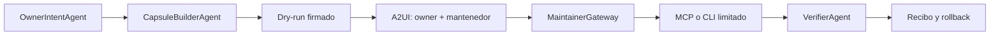

# Capsula A2A de implementacion

**Estado:** arquitectura aprobada; Block 5A manual desplegado sin escritura sobre sitios

**Fecha:** 2026-08-28

## Problema

El owner real de un sitio puede no controlar el hosting, CMS o DNS. Agent Friendly Web no debe resolver esa friccion pidiendo credenciales generales ni intentando eludir al mantenedor. Debe crear un canal limitado, verificable y reversible para una operacion autorizada.

## Arquitectura

## Contenido de una capsula

- `capsule_id`, version y expiracion;
- owner, dominio y aprobadores referenciados por IDs, no secretos;
- archivos con SHA-256;
- rutas de destino allowlisted;
- permisos solicitados;
- diff y dry-run;
- condiciones de idempotencia;
- version o backup anterior;
- pruebas posteriores y rollback;
- recibo metadata-only.

## Separacion de responsabilidades

- **A2A** coordina agentes, estados, cancelacion y delegacion.
- **A2UI** presenta el diff y obtiene decisiones humanas.
- **MCP** expone tools acotadas a un servidor autorizado.
- **CLI** permite aplicar el mismo contrato de manera reproducible.
- **Secret Broker** entrega capacidades al ejecutor, nunca secretos al modelo o a la capsula.

## Gates

1. **Cumplido localmente:** generacion determinista y validacion de hashes.
2. **Cumplido localmente:** revision humana, descarga JSON y cero escritura remota.
3. **Cumplido y desplegado:** decisiones owner/mantenedor ligadas al hash, idempotencia, expiracion y auditoria metadata-only.
4. **Cumplido en D1 local y remota:** migraciones aditivas; la D1 remota creo solo las dos tablas previstas y quedo vacia tras el release.
5. **Cumplido y desplegado:** diff acotado contra archivos publicos y plan de Draft PR descargable, sin envio ni merge.
6. **Cumplido localmente:** adaptador efimero con backup, apply canary sobre una ruta, verificacion y rollback.
7. **Pendiente y sujeto a aprobacion separada:** primer proveedor real y primera escritura canary sobre una ruta no critica.
8. **Futuro:** ampliacion por proveedor y coordinacion A2A real.

## Block 5A implementado

La version actual usa `manual_handoff`: prepara `llms.txt`, `llms-full.txt` y propuestas de integracion manual para `robots.txt`, `sitemap.xml` y JSON-LD, siempre segun el intake aprobado y sin fabricar OpenAPI, MCP o skills inexistentes. Cada version es inmutable, vence a los siete dias y conserva hashes SHA-256.

La interfaz privada permite revisar contenido y destinos, descargar el paquete y registrar decisiones humanas. Si el owner y el mantenedor son personas distintas, ambas aprobaciones son necesarias. La identidad y el rol se derivan en el servidor; no se confia en un rol enviado por el navegador.

Existe lectura publica acotada del archivo actual, plan tecnico de Draft PR y laboratorio efimero de apply/rollback. No existe envio remoto, merge, adaptador CMS real, Secret Broker conectado ni escritura sobre dominios. El nombre historico “Capsula A2A” describe la arquitectura final; este candidato no publica Agent Card ni ejecuta A2A.

No se publica Agent Card ni tool mutante hasta que exista un agente remoto real, identidad, scopes, auditoria y cancelacion verificadas.

La evidencia local vive en `docs/BLOCK-5A-LOCAL-D1-GATE-2026-08-28.md` y el recibo remoto en `docs/BLOCK-5A-REMOTE-RELEASE-RECEIPT-2026-08-28.md`. El release no habilita por si mismo Draft PR, CMS, A2A ni escrituras sobre dominios registrados.
