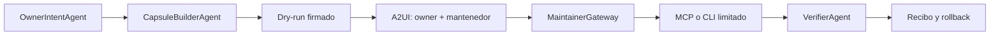

# Capsula A2A de implementacion

**Estado:** arquitectura aprobada; Bloque 5A candidato local verificado; conectores remotos futuros
**Fecha:** 2026-08-27

## Problema

El owner real de un sitio puede no controlar el hosting, CMS o DNS. Agent Friendly Web no debe resolver esa friccion pidiendo credenciales generales ni intentando eludir al mantenedor. Debe crear un canal limitado, verificable y reversible para una operacion autorizada.

## Arquitectura

## Contenido de una capsula

- `capsule_id`, version y expiracion;
- owner, dominio y aprobadores referenciados por IDs, no secretos;
- archivos con SHA-256;
- rutas de destino allowlisted;
- permisos solicitados;
- diff y dry-run;
- condiciones de idempotencia;
- version o backup anterior;
- pruebas posteriores y rollback;
- recibo metadata-only.

## Separacion de responsabilidades

- **A2A** coordina agentes, estados, cancelacion y delegacion.
- **A2UI** presenta el diff y obtiene decisiones humanas.
- **MCP** expone tools acotadas a un servidor autorizado.
- **CLI** permite aplicar el mismo contrato de manera reproducible.
- **Secret Broker** entrega capacidades al ejecutor, nunca secretos al modelo o a la capsula.

## Gates

1. generacion offline y validacion de hashes;
2. dry-run local;
3. adaptador de Draft PR sin merge;
4. adaptador CMS en entorno de prueba;
5. doble consentimiento y rollback probado;
6. primera escritura canary sobre una ruta no critica;
7. ampliacion por proveedor.

No se publica Agent Card ni tool mutante hasta que exista un agente remoto real, identidad, scopes, auditoria y cancelacion verificadas.

## Estado del Bloque 5A

La primera base comun ya existe como candidato local verificado:

- capsula inmutable con SHA-256, firma Ed25519, expiracion y rutas allowlisted;
- eventos metadata-only para dominio, owner, mantenedor, aplicacion, verificacion y rollback;
- proyeccion de estado que impide saltos y no permite reutilizar una aprobacion en otra capsula;
- plan offline de Draft PR con `draft: true`, `executed: false` y `auto_merge: false`.

Este candidato no crea ramas, commits ni pull requests, no se conecta con GitHub o WordPress y no usa credenciales. Los schemas tampoco se anuncian aun como capacidades desplegadas. La evidencia y los limites completos se registran en `docs/BLOCK-5A-PUBLISHING-CAPSULE-GATE-2026-08-28.md`.

El siguiente gate incorpora una fixture Git sintetica y un recibo reproducible. La GitHub App y el plugin WordPress conservan aprobaciones separadas posteriores.
