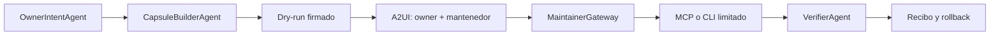

# Capsula A2A de implementacion

**Estado:** arquitectura aprobada; implementacion futura  
**Fecha:** 2026-08-27

## Problema

El owner real de un sitio puede no controlar el hosting, CMS o DNS. Agent Friendly Web no debe resolver esa friccion pidiendo credenciales generales ni intentando eludir al mantenedor. Debe crear un canal limitado, verificable y reversible para una operacion autorizada.

## Arquitectura

## Contenido de una capsula

- `capsule_id`, version y expiracion;
- owner, dominio y aprobadores referenciados por IDs, no secretos;
- archivos con SHA-256;
- rutas de destino allowlisted;
- permisos solicitados;
- diff y dry-run;
- condiciones de idempotencia;
- version o backup anterior;
- pruebas posteriores y rollback;
- recibo metadata-only.

## Separacion de responsabilidades

- **A2A** coordina agentes, estados, cancelacion y delegacion.
- **A2UI** presenta el diff y obtiene decisiones humanas.
- **MCP** expone tools acotadas a un servidor autorizado.
- **CLI** permite aplicar el mismo contrato de manera reproducible.
- **Secret Broker** entrega capacidades al ejecutor, nunca secretos al modelo o a la capsula.

## Gates

1. generacion offline y validacion de hashes;
2. dry-run local;
3. adaptador de Draft PR sin merge;
4. adaptador CMS en entorno de prueba;
5. doble consentimiento y rollback probado;
6. primera escritura canary sobre una ruta no critica;
7. ampliacion por proveedor.

No se publica Agent Card ni tool mutante hasta que exista un agente remoto real, identidad, scopes, auditoria y cancelacion verificadas.
