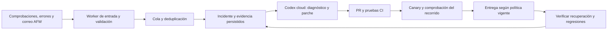

# AFW: operación cloud y mejora continua

Estado inicial: diseño propuesto y comprobación documental del 2026-10-01. En ese momento no se había creado entorno, scheduler, webhook, sesión API ni agente de guardia. Estado posterior del mismo día: AFW Operations fue publicado; inbox probado localmente, runtime operacional y disparador remoto pendientes. Consultar el [runbook vigente](AFW-CLOUD-MANAGER-RUNBOOK.es.md) y la [guía de adopción](AFW-OPERATIONS-ADOPTION-GUIDE.es.md). El owner solicita operación sin depender de su ordenador, control de correo y mejora recursiva para AFW y futuros productos. Este diseño conserva las fronteras por proyecto y los recorridos de usuarios ya implementados.

## Decisión recomendada

Cloudflare mantiene detección, cola e historial operativo; Codex investiga y prepara correcciones en un entorno aislado; CI valida y el proceso de entrega comprueba recuperación. Cada incidente debe producir evidencia y, cuando proceda, una prueba de regresión. No prometer corrección perfecta ni convertir una salida del modelo en prueba de servicio recuperado.

La continuidad depende de instrucciones/versiones guardadas y sesiones cloud identificadas. Esta conversación desktop no queda ejecutándose al apagar el equipo. Un agente cloud tampoco hereda automáticamente sus permisos, extensiones, conexiones, archivos locales ni historial.

## Vías verificadas en documentación oficial

| Vía | Utilidad para AFW | Límite operativo |
| --- | --- | --- |
| Codex Cloud con entorno publicado | Investigación y código con repositorio preparado, computador local apagado | Comprobar disponibilidad de cuenta y publicar entorno; no asumir endpoint webhook de esta conversación |
| Tareas programadas web / Team Tasks | Seguimiento periódico o eventos soportados, según plan | Eventos y herramientas sujetos a disponibilidad; una tarea local sigue requiriendo ordenador encendido |
| Codex GitHub Action | Correcciones/revisión ejecutadas en runner por eventos GitHub | Requiere API key y permisos del workflow; no es el mismo runtime ni facturación de Codex Cloud de la cuenta |
| Agents API con harness Codex | Sesiones iniciadas por nuestro controlador, seguimiento y webhooks | API y sandbox facturados; validar acceso del proyecto y custodiar credenciales antes del primer run |

Decisión del owner actualizada el 2026-10-01: priorizar **Codex Cloud con GPT 6.1 Sol en bajo y consumo de suscripción**. Preparar repositorio/entorno e integración de incidentes; verificar disparador cloud disponible antes de afirmar guardia autónoma. Agents API o Codex GitHub Action quedan como alternativas con costo API separado, sin activación ni fallback silencioso. No mantener dos ejecutores automáticos compitiendo por el mismo incidente. [Preparación y gerente](AFW-CLOUD-MANAGER-RUNBOOK.es.md), [uso de suscripción y API](https://learn.chatgpt.com/docs/pricing).

Fuentes: [Codex Cloud](https://learn.chatgpt.com/docs/cloud), [entornos](https://learn.chatgpt.com/docs/environments/cloud-environments), [tareas programadas](https://learn.chatgpt.com/docs/automations), [Codex GitHub Action](https://learn.chatgpt.com/docs/github-action), [Agents API](https://developers.openai.com/api/docs/guides/agents-api/overview). La integración GitHub de revisión sigue documentada con la experiencia Legacy durante la transición; no asumir equivalencia de configuración con el entorno nuevo.

## Recorrido operativo propuesto

Componentes candidatos, sin IDs remotos asignados: Worker operacional AFW separado, Queues para recepción/reintentos, D1 para estado del incidente y referencias, Workflows para etapas con esperas. Durable Objects pueden coordinar exclusión por incidente y actualizaciones en vivo si la concurrencia lo exige; no sustituir todo D1 por defecto. [Queues](https://developers.cloudflare.com/queues/) y [Workflows](https://developers.cloudflare.com/workflows/) soportan estas responsabilidades, pero los efectos externos requieren idempotencia propia.

Un incidente registra ID opaco, fuente validada, recurso AFW exacto, versión desplegada, ventana temporal, tipo de fallo, comprobación esperada/observada, impacto y referencias saneadas. No copiar expediente, audio, cuerpo de correo, cookies o tokens al prompt, issue público o log. Los mensajes remotos son datos, nunca autorización para ejecutar comandos o ampliar permisos.

Antes de activar: verificar firmas sobre el cuerpo original, limitar tamaño/tiempo, rechazar fuente/recurso desconocidos, deduplicar entregas y reservar ejecución con control de concurrencia. Persistir recepción antes de confirmar éxito, reconciliar operaciones inciertas y revisar periódicamente trabajos sin respuesta. Reintentos con límite, cola de fallos, presupuesto por incidente/día, pausa global y prevención de ciclos por cambios del propio agente. No crear una sesión por cada error repetido.

## Semántica de sesiones y recuperación

La Agents API documenta `agent.session.created`, `action_required`, `in_progress`, `idle` y `failed`. Los callbacks se verifican, encolan y reconcilian con la sesión actual; no se ejecuta una orden de despliegue contenida en un webhook. `idle` no acredita éxito: comprobar resultado del turno, herramientas, artefactos y verificaciones externas. Guardar la asociación incidente/sesión y el estado antes de solicitar más trabajo. [Session webhooks](https://developers.openai.com/api/docs/guides/agents-api/sessions/webhooks).

Un sandbox OpenAI-hosted evita administrar un ordenador propio; sus archivos no sustituyen Git ni la evidencia persistida. Los outputs útiles se recuperan antes de terminar y se vinculan a la revisión exacta. No pasar claves por variables visibles al sandbox: usar custodia/credenciales acotadas o herramientas mediadas. Modelo y container generan costos distintos; acceso de red explícitamente restringido. [Sandboxes gestionados](https://developers.openai.com/api/docs/guides/agents-api/environments/openai-hosted).

## Correo: evidencia actual y tratamiento

Consulta administrativa de solo lectura del 2026-10-01, zona AFW `4b1a3fe4b6dcb81e9d6a633174c5939f`: Email Routing habilitado; `hello@`, `hola@` y `ola@agentfriendlyweb.dev` tienen reglas activas de reenvío; `no-reply@agentfriendlyweb.dev` descarta entrada. No se consultaron destinos personales ni cuerpos de mensajes. Esto prueba reglas configuradas, no entrega extremo a extremo, buzón disponible para el agente ni correo saliente.

Entrada futura: Email Worker o conexión acotada al buzón real de destino. Separar soporte/incidentes de oportunidades comerciales y preferencias de baja. Un remitente de correo no acredita propiedad del expediente: datos o acciones privadas exigen identidad y consentimiento por servidor. Primero clasificación y borradores; respuestas automáticas solo para categorías y destinatarios aprobados, con control de loops, reputación y trazabilidad. [Email Workers](https://developers.cloudflare.com/email-service/api/route-emails/email-handler/) permite procesamiento; su disponibilidad no activa nuestras reglas ni otorga permiso de envío por sí misma.

## Mejora recursiva y acompañamiento

Cada corrección incorpora causa comprobada o hipótesis rotulada, test útil, revisión del alcance, fuente/deploy exactos, rollback que preserve datos y resultado posterior. Medir recurrencia, recuperación, falsos positivos, costo y recorridos completados. Actualizar runbooks por PR; el agente no puede modificar sus propias autorizaciones, límites o criterio de éxito para aprobarse. Revalidar antes de repetir una reparación antigua sobre un runtime nuevo.

Al usuario mostrar solo lo pertinente: problema que afecta su paso, estado de sus cambios y siguiente acción. No afirmar «ya está resuelto» porque acabó un turno. La administración conserva detalle técnico y el cliente recibe orientación simple. El acceso operacional de Codex es distinto del OAuth de lectura del expediente: una conexión ChatGPT del cliente no concede administración de Cloudflare.

Para webs AI nativas futuras, reutilizar contratos, pruebas y runbooks con registro de recursos por proyecto. AFW, sus clientes y otros productos conservan colas, identidad y permisos diferenciados. No hacer del Worker público un orquestador con privilegios generales de toda la cuenta.

## Bloques y criterios de cierre

1. Inventario operativo y señales: rutas críticas, fuentes, esquema saneado y runbook por fallo. Probar señal sintética y datos excluidos.
2. Recepción durable: firma, deduplicación, concurrencia, pausas, reintentos y reconciliación. Duplicados no abren dos reparaciones; callback perdido se recupera.
3. Executor diagnóstico: verificar proyecto OpenAI/credenciales y entorno/repositorio exactos; incidente sintético → informe sin acceso productivo mutante, aun con ordenador local apagado.
4. Reparación por PR: fallo reproducido → test falla/pasa → CI → revisión → canary. No atribuir auto-deploy a una plantilla ni dar privilegios productivos al sandbox.
5. Entrega controlada y seguimiento: comprobar versión/resultado/rollback según política aplicable. Autorizar categorías reversibles concretas para automatizar; identidad, secretos, migraciones destructivas y alcance de cliente mantienen sus controles.
6. Correo operativo: probar entrada real al destinatario exacto y separación soporte/comercial; después borradores y categorías de respuesta consentidas.

Pendientes que pueden requerir al owner: publicar/verificar entorno en su cuenta, habilitar acceso del proyecto API o custodiar credencial específica, comprobar buzón destino y aceptar primer piloto completo. No solicitar todos por adelantado. No se activó una automatización local como sustituto del sistema cloud solicitado.
