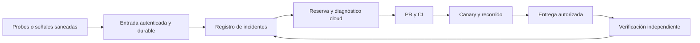

# Guía de adopción: gerencia cloud y Fix Center operativo

Actualización4deoctubre: receptor/productor aislados y entrega manual por binding aceptados en [PR224](AFW-PRODUCER-BINDING-ACCEPTANCE-2026-10-04.es.md). Ocho eventos sintéticos conservados; cierre sin firma/cadencia. Cron, consumidor real y watchdog siguen como criterios independientes. Código cloud, subida inactiva y envío propio cuentan con recibos posteriores al estado inicial descrito abajo; consultar [runbook reconciliado](AFW-CLOUD-MANAGER-RUNBOOK.es.md) antes de asumir que falta crear recursos o que la gerencia está activa.

Fecha: 2026-10-01. Destinatario: chat «Tokenizart / Atelier · Operación y descubrimiento». Proyecto fuente: AFW, repositorio `tokenizartinfo-ops/agent-friendly-web`. Esta guía transmite patrones; no concede permisos ni configura recursos Tokenizart. La implementación correspondiente pertenece a su repositorio responsable.

## Resultado buscado y estado real

Detectar un fallo, conservar evidencia, investigar una sola vez, preparar una corrección revisable y comprobar recuperación del recorrido del usuario sin depender del ordenador del owner. La detección, la investigación y la entrega son responsabilidades distintas.

AFW ya tiene el contrato de señales, entrada firmada e inbox probado localmente, y un entorno Codex Cloud publicado. Todavía no tiene el runtime operacional remoto, consumidor, disparador confirmado ni prueba integral con ordenador apagado. El entorno publicado no demuestra vigilancia 24/7. El setup pasó 649 tests, lint, build y smoke 11/11; eso prueba preparación del código, no operación continua.

Fuentes: [runbook vigente](AFW-CLOUD-MANAGER-RUNBOOK.es.md), [diseño](AFW-CLOUD-OPERATIONS-DESIGN-2026-10-01.es.md), [experiencia de entrega](AFW-DELIVERY-EXPERIENCE.es.md). Código inicial: PR #148, merge `52610ec`; corrección smoke PR #149, merge `5c15c0a`; documentación cloud PR #150, merge `a93f326`; experiencia PR #151, merge `3fcd661be852ea280f2931f5b6625febb614c691`. Verificar la revisión actual antes de reutilizar.

## Ventajas operativas y cómo demostrarlas

| Ventaja esperada | Mecanismo | Evidencia de aceptación |
| --- | --- | --- |
| Continuidad sin PC | Detección y persistencia cloud; ejecutor cloud con disparador real | Incidente sintético procesado con ordenador apagado y recibos de cada etapa |
| Menos trabajo duplicado | Agrupación por recurso/check/versión, idempotencia y reserva exclusiva | Eventos repetidos producen una única investigación; reserva vencida recuperable |
| Recuperación más segura | PR, CI, canary, versión exacta y rollback | Fallo reproducido, regresión falla/pasa, versión entregada y recorrido recuperado |
| Menor costo y ruido | Agrupar ráfagas, límites de intentos y presupuesto | Número de señales frente a investigaciones, cupo/costo por incidente y falsos positivos |
| Menos dependencia de memoria del chat | Runbooks y resultados versionados en Git | Otro turno continúa desde evidencia y pendiente preciso, sin copiar historial privado |
| Mejor acompañamiento | Estado técnico separado del mensaje al cliente | Cliente conserva cambios, entiende la próxima acción y no recibe ruido interno |
| Mejora acumulativa | Causa comprobada o hipótesis rotulada, test y experiencia saneada | Menor recurrencia medida en una ventana comparable, sin promesas anticipadas |
| Escalabilidad entre productos | Contratos reutilizables, recursos y permisos separados | Un evento de otro proyecto es rechazado y no activa un ejecutor ajeno |

Son objetivos medibles, no beneficios comerciales ya demostrados. Empezar por incidentes frecuentes y reversibles; no multiplicar agentes, colas o bases sin una necesidad concreta.

## Arquitectura y responsabilidades

Cloudflare conserva hechos y estado; Codex explica y prepara cambios. Una señal o correo remoto no es una instrucción confiable. Un diagnóstico terminado no cierra un incidente. Un deploy exitoso tampoco demuestra que el usuario pueda completar su tarea.

El inbox AFW actual utiliza D1 y una recepción batch transaccional. `lib/operations-ledger.mjs` implementa `recordSignal`, `claimIncident` y `finishInvestigation`; `lib/operations-ingress.mjs` valida la entrada; `worker/operations/index.mjs` conecta el handler y `schema.sql` define el almacenamiento separado. No copiar literalmente el recurso `afw_public_web` ni las tres familias de checks a Tokenizart: crear su propio contrato cerrado y registro de recursos.

Queues, Workflows y Durable Objects son opciones para etapas futuras. Workflows puede conservar esperas/reintentos; Queues desacopla recepción/consumo; Durable Objects puede coordinar concurrencia y actualizar una vista en vivo. No están implementados en esta cadena operacional y no reemplazan por sí solos la verificación de efectos externos o el expediente durable.

El Fix Center operativo conserva incidentes y referencias opacas. El Fix-Center de arquitectura conserva propuestas estructurales y aprobaciones. No copiar tickets, conversaciones ni datos owner entre ellos. Elevar únicamente una decisión con referencia opaca cuando una reparación necesite cambiar arquitectura, privacidad, identidad o política.

## Contrato mínimo y controles reutilizables

AFW acepta solamente seis campos: `eventId`, `resource`, `check`, `version`, `observedAt`, `result`. La versión es el UUID de despliegue observado; resultado `failed` o `recovered`. El productor debe demostrar recurso/versión y medir realmente; una firma no acredita la medición.

Firma HMAC SHA-256 sobre timestamp, punto y bytes originales; secret de al menos 32 caracteres en custodia, nunca en Git/prompts/logs. Ventana de firma cinco minutos, señal no anterior a 24 horas, cuerpo máximo 8192 bytes y tiempo de upload tres segundos. Campos extra y recursos desconocidos se rechazan. Persistir antes del ACK. Un mismo ID con payload distinto es colisión, no reintento aceptable.

Agrupación por recurso/check/versión. Reserva cinco minutos con token de fencing, máximo tres investigaciones por fingerprint. Una señal posterior invalida la conclusión sobre el estado anterior; una recuperación antigua no puede cerrar una falla nueva. Agotar intentos lleva a revisión humana, sin bucle infinito. Falta implementar presupuesto global, retención, cola de fallos y reconciliación remota antes de activar el consumidor.

Callbacks GitHub/OpenAI y correo necesitan verificadores/adaptadores propios; no reutilizar la firma HMAC AFW como si fuera su protocolo. Cada webhook se persiste, deduplica y reconcilia con el estado real de la operación.

## Accesos, runtime, privacidad y costos

- Preparar un entorno exclusivo del repositorio Tokenizart adecuado; no conceder acceso al repositorio entero del segundo cerebro por comodidad. El entorno AFW publicado se llama AFW Operations, setup `01a0f7d3-a806-76c5-a024-6ddf4ccb401b`, revisión preparada `5c15c0a`, privacidad Solo yo.
- AFW comprobó GPT-6.1 Sol Bajo y red restringida a `github.com` y `registry.npmjs.org`, Node 24.19.0. Es evidencia de ese setup, no configuración automática de otro entorno ni permiso para acceder a hosting. Agregar un dominio exige finalidad y alcance concretos.
- Cloud no hereda sesiones Chrome, OTP, extensiones, OneDrive, correo ni permisos del chat desktop. Git guarda código/runbooks; la custodia conserva secretos; el registro operativo guarda señales saneadas.
- Empezar con diagnóstico sin escritura productiva. Las herramientas mediadas autorizan recursos/acciones concretos. No entregar credenciales generales de Cloudflare, Portainer, SSH o hosting al agente por conveniencia.
- El OAuth de un cliente para leer su expediente no es acceso administrativo. Owner Live, wallet, Mint, Certify, transferencias y privacidad conservan controles específicos de identidad y consentimiento.
- Preferencia de Gabriel: Codex Cloud con GPT-6.1 Sol bajo y cupo de suscripción. Medir consumo y disponibilidad; no hay estimación numérica fiable por incidente todavía. Agents API y Codex GitHub Action usan facturación API separada; no activar fallback silencioso ni dos ejecutores competidores.
- Medir también costo Cloudflare de almacenamiento, ejecuciones y reintentos una vez elegidos recursos y carga. No presentar una arquitectura prevista como costo cero.

## Adopción cronológica y criterio de cierre

1. **Inventario propio:** elegir un recorrido Copilot y documentar proyecto, repositorio, entorno, origen, recurso, versión, permisos y rollback. Cierra con una señal sintética saneada y un evento extranjero rechazado. No usar datos owner reales para comenzar.
2. **Recepción durable aislada:** crear recursos operacionales separados y aplicar su schema sin tocar bases de usuarios. Probar duplicado, colisión, desorden temporal, reserva vencida y caída de storage. Cierra solo con recibos remotos y pausa comprobada.
3. **Entorno y primera tarea manual:** seleccionar repositorio, publicar entorno con tests y red limitada. Ejecutar diagnóstico sintético y conservar informe/artefacto ligado al incidente. Cierra cuando funciona con PC apagado; el setup publicado no basta.
4. **Disparador real:** inspeccionar eventos/cadencias disponibles en la cuenta y probar uno end to end. Todavía no se verificó un endpoint arbitrario Cloudflare → tarea Codex Cloud con suscripción. Si falta, registrar bloqueo y evaluar una alternativa explícita; no sustituir por automatización desktop.
5. **Reparación por PR:** elegir fallo reversible, reproducir, añadir test útil, preparar patch y pasar CI. Cierra con canary y comprobación del recorrido, sin permisos sobre acciones owner. Un fallo no reproducido puede producir diagnóstico, no una reparación afirmada.
6. **Entrega y recuperación:** categorías autorizadas de efectos, versión exacta y rollback previamente verificado. Rechequear estado antes de reintentar una escritura incierta. Cierra con recuperación posterior del mismo recorrido y ausencia de regresiones relevantes.
7. **Ampliación gradual:** retención, presupuesto diario, dead-letter, conciliación y métricas. Después correo operativo: probar recepción/destino y consentimiento antes de automatizar respuestas. Un remitente no demuestra identidad del cliente.

Requieren intervención humana únicamente cuando corresponda: autorización persistente del conector/repositorio, publicación/configuración de la cuenta, permiso productivo concreto, custodia de una credencial imprescindible, prueba de buzón o aceptación del piloto. No pedir todos por adelantado ni pedir secretos por chat.

## Rollback y comunicación

Pausar recepción/consumo por separado. Retirar rutas o volver a versión previa conserva el registro; no borrar D1 ni historial como rollback. Un diagnóstico fallido libera o deja vencer reserva sin ejecutar efectos. Un patch revertido preserva datos y compara cambios concurrentes antes de restaurar. Medir recuperación después de cualquier rollback.

Mensaje de incidente al cliente: «Estoy revisando un problema que afecta este paso. Tus cambios guardados siguen disponibles. Te avisaré cuando pueda comprobar que podés continuar». Utilizarlo solo si el estado de guardado está comprobado. No afirmar acompañamiento activo si no existe un ejecutor que esté investigando. Si requiere una acción, indicar una sola, con su motivo. Al cerrar: resultado concreto, evidencia y siguiente paso, sin volcar logs.

## Instrucción lista para el chat responsable

> Reutiliza el patrón AFW en un diseño separado para Tokenizart/Atelier. Lee esta guía y los recibos referenciados; verifica revisión y recursos propios antes de operar. Primero inventario y señal sintética, luego inbox remoto aislado, entorno cloud, tarea manual y disparador comprobado con PC apagado. Mantén Fix Center operativo separado de arquitectura. Diagnostica y prepara PRs sin ampliar permisos. Conserva identidad/consentimiento owner y datos. No afirmes guardia, recuperación, auto-deploy o correo funcionando sin aceptación end to end. Registra evidencia, pendiente y próxima acción; pide al owner solo la intervención imprescindible para el bloque concreto.
