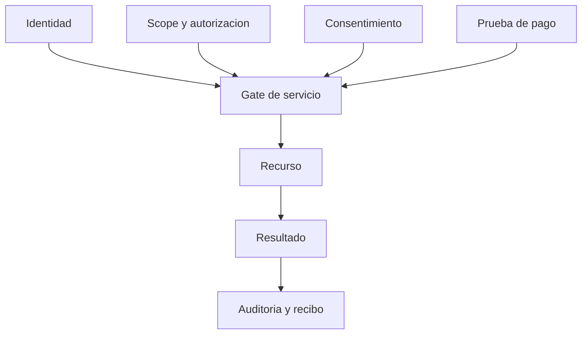
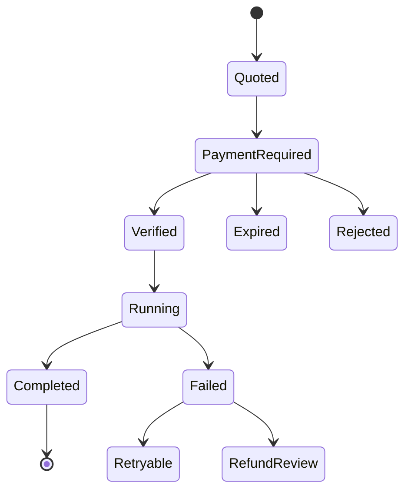

# Agentic Commerce: x402 and MPP Architecture v1

**Estado:** arquitectura de investigacion; no desplegada

**Fecha:** 2026-08-31

**Alcance:** recursos pagos para agentes, separados de identidad y autorizacion

## Proposito

Permitir que un agente descubra un recurso, conozca su precio, pague y reciba una salida verificable sin una negociacion humana por cada solicitud. El primer caso debe ser pequeño, repetible y sin permisos de escritura sobre el sitio de un cliente.

## Recurso candidato

El primer candidato es una **reauditoria machine-readable con External Evidence Pack** sobre un dominio publico. Es apropiado porque:

- usa lectura publica;
- tiene costo y salida delimitables;
- puede ejecutarse de forma idempotente;
- no necesita identidad owner para el resultado basico;
- produce un artefacto verificable;
- no modifica el dominio.

No se vendera como prueba de ranking ni como certificacion.

## Contrato conceptual

### Entrada

- dominio HTTPS publico;
- perfil de auditoria versionado;
- idioma del reporte;
- idempotency key;
- formato `json`, `markdown` o paquete firmado.

### Salida

- ID de ejecucion;
- timestamp y version de metodologia;
- evidencias HTTP saneadas;
- resultado AF separado de auditores externos;
- hallazgos y recomendaciones;
- limites;
- SHA-256 del artefacto;
- recibo de pago metadata-only.

### Exclusiones

- crawling autenticado;
- acceso owner;
- publicacion;
- Draft PR remoto;
- cambio DNS;
- promesa de indexacion;
- datos personales;
- ejecucion de una tool mutante.

## Separacion de controles

El pago demuestra que se satisfizo una condicion economica. No demuestra que el pagador controla un dominio, que puede publicar o que acepta un tratamiento de datos distinto.

## Flujo x402

1. El agente solicita el recurso.
2. El servidor responde HTTP `402` con requisitos de pago.
3. El agente o wallet obtiene una prueba mediante un facilitador compatible.
4. Reintenta con la prueba en `PAYMENT-SIGNATURE`.
5. El servidor verifica pago, precio, recurso, expiracion e idempotencia.
6. Ejecuta una vez o devuelve el resultado ya asociado a esa idempotency key.
7. Responde con el artefacto y `PAYMENT-RESPONSE`.

Cloudflare documenta x402 para recursos HTTP y tools MCP. Esa disponibilidad no convierte el flujo en apto para produccion sin catalogo, conciliacion, impuestos, reembolsos y soporte.

## MPP y otros rails

Cloudflare documenta soporte para x402 y Machine Payments Protocol en su capa de pagos para agentes. La eleccion se realizara por:

- compatibilidad con clientes;
- moneda y red;
- facilitador y custodia;
- costo por transaccion;
- conciliacion;
- reversibilidad y disputas;
- requisitos legales y contables;
- madurez del protocolo.

La arquitectura conserva un `PaymentAdapter` para no fijar el producto a un unico rail. El contrato comercial es estable aunque cambie el mecanismo de pago.

## Pagos humanos

El checkout humano sigue siendo prioritario para los primeros pilotos. Debe mostrar:

- servicio y alcance;
- precio total y moneda;
- impuestos si corresponden;
- datos de facturacion necesarios;
- politica de cancelacion o reembolso;
- contacto de soporte;
- recibo.

La cuenta Mercury o cualquier otra cuenta receptora se configura fuera del repositorio y solo despues de aprobacion Nivel 1. No se guardan numeros de tarjeta, datos bancarios ni secretos en D1, prompts, GitHub o el paquete de evidencia.

## Catalogo machine-readable futuro

Cada oferta agentica declarara:

- `offer_id` y version;
- recurso y metodo;
- precio, moneda y red;
- vigencia;
- limites de volumen;
- tiempo esperado;
- schema de entrada y salida;
- politica de error y reembolso;
- soporte;
- autenticacion y scopes, si aplican;
- estado `sandbox`, `canary` o `production`.

El catalogo no se publica hasta que al menos una oferta exista y pase pruebas.

## MCP futuro

La tool candidata podria llamarse `afw.generate_external_evidence_pack`, pero el nombre no representa una tool desplegada. Su contrato requiere:

- `readOnlyHint: true` para la auditoria publica;
- pago antes de la ejecucion costosa;
- input schema cerrado;
- rate limits;
- timeout y limites de respuesta;
- idempotencia;
- resultado sin secretos;
- enlace a metodologia y soporte.

## Modelo de estados

## Riesgos y mitigaciones

| Riesgo | Mitigacion |
| --- | --- |
| doble cobro | idempotency key y ledger de recibos |
| precio cambiado | quote versionado y expiracion |
| pago valido para otro recurso | binding a offer, dominio y request hash |
| resultado duplicado | cache por idempotencia y hash |
| fallo despues del pago | estado retryable o revision de reembolso |
| agente malicioso | limites, SSRF controls y schemas cerrados |
| claims comerciales | reporte con metodologia y limites |
| custodia de fondos | adaptador y proveedor aprobados; no asumir Cloudflare Wallets operativa |
| pago usado como autorizacion | controles de identidad/scope separados |

## Gates

1. Definir la oferta y costo real.
2. Aprobar proveedor, moneda, contabilidad, impuestos y reembolsos.
3. Publicar schema y catalogo solo en sandbox.
4. Implementar PaymentAdapter y ledger sin fondos reales.
5. Probar pagos validos, invalidos, vencidos, repetidos y fallidos.
6. Ejecutar canary allowlisted con limite monetario.
7. Conciliar cada pago y cada artefacto.
8. Publicar oferta productiva y reauditar discovery.

## Criterio para contabilizar comercio en AF-5

La sola presencia de un archivo x402 no suma una capacidad. Deben existir oferta real, endpoint o tool, precio, flujo verificable, recibo, soporte, negativas y prueba externa. Comercio sigue siendo un perfil separado cuando no aplica al sitio analizado.

## Fuentes primarias

- Cloudflare x402: `https://developers.cloudflare.com/agents/tools/payments/x402/`
- Cloudflare agent payments: `https://developers.cloudflare.com/agents/tools/payments/`
- Cloudflare Wallets: `https://developers.cloudflare.com/wallets/`
- x402 Foundation: `https://github.com/x402-foundation/x402`
