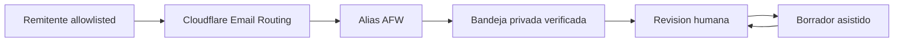

# Gate 6C.1 - Email Identity and Inbound Canary

**Fecha:** 2026-09-02

**Estado:** `remote_routing_configured_test_pending`; DNS y reglas entrantes aplicados, prueba sintetica desde un remitente externo pendiente

## Objetivo

Crear una primera identidad de correo propia para Agent Friendly Web y comprobar recepcion entrante con el menor alcance posible. Gate 6C.1 no crea una operacion autonoma de email: establece routing, evidencia y rollback antes de evaluar salida autenticada.

La frontera cubre recepcion y clasificacion de metadata minima; no convierte el contenido del mensaje en una nueva base de conocimiento.

## Direcciones

- canonica: `hello@agentfriendlyweb.dev`;
- idioma: `hola@agentfriendlyweb.dev` y `ola@agentfriendlyweb.dev`;
- funcion futura: `auditoria@`, `seguridad@` y `bajas@`;
- `no-reply@agentfriendlyweb.dev` no acepta entrada.

Los aliases convergen en una bandeja operativa privada. La direccion de destino, el propietario de la cuenta y los factores de recuperacion no se publican ni se guardan en el repositorio.

## Arquitectura recomendada

Cloudflare Email Routing transporta el mensaje a la bandeja aprobada. La aplicacion y los modelos reciben, como maximo, metadata minima saneada cuando una persona solicita asistencia: identificador opaco, alias receptor, categoria, idioma, fecha y estado. El cuerpo y los adjuntos no se copian a D1, logs, RAG, CRM ni al repositorio.

## Alcance 6C.1

1. inventariar DNS actual del dominio sin modificarlo;
2. preparar el diff de Cloudflare Email Routing;
3. confirmar bandeja de destino y recovery fuera del repositorio;
4. configurar solo aliases aprobados;
5. mantener newsletter fuera de alcance;
6. probar recepcion desde remitentes allowlisted;
7. verificar que no existe envio desde el dominio;
8. registrar recibo metadata-only;
9. ensayar el rollback sin borrar evidencia.

## Protecciones

- recepcion limitada a tres aliases literales; el catch-all permanece deshabilitado;
- allowlist temporal para la prueba;
- kill switch independiente del sitio publico;
- sin D1 para cuerpos, headers completos ni adjuntos;
- sin reenvio a mas de una bandeja;
- sin respuesta automatica;
- sin clasificacion generativa previa a revision humana;
- sin datos de Tokenizart, Companion, Copilot, Atelier u Owner Live;
- sin credenciales en GitHub, prompts o documentacion.

## No autorizado

Gate 6C.1 no autoriza envio autonomo, respuestas automaticas, campanas, newsletter, marketing, compromisos, precios finales, contratos, pagos, bajas ejecutadas ni lectura indiscriminada de la bandeja. La newsletter queda fuera de alcance y requerira consentimiento y politica propios.

## Prueba sintetica

La prueba usa mensajes sin PII real y comprueba:

- cada alias llega una sola vez;
- `no-reply@` falla cerrada;
- el remitente no allowlisted se conserva fuera del flujo asistido;
- no se crea fila con cuerpo o adjunto;
- no se envia respuesta;
- desactivar el routing detiene la prueba;
- restaurar el estado previo completa el rollback.

## Rollback

1. activar el kill switch;
2. deshabilitar los aliases de prueba;
3. comprobar que el routing ya no entrega;
4. restaurar el registro DNS anterior si el diff aprobado lo exige;
5. conservar solo recibos metadata-only;
6. documentar causa y resultado.

## Criterio de salida

- routing entrante verificado desde una identidad allowlisted;
- cero envios desde el dominio;
- cero cuerpos o adjuntos persistidos en sistemas AFW;
- kill switch y rollback comprobados;
- direccion canonica y aliases documentados;
- revision humana obligatoria visible.

## Gate 6C.2

Gate 6C.2 seleccionara un proveedor de salida, autenticara remitente con SPF/DKIM/DMARC y probara borradores transaccionales allowlisted con envio humano. Requiere especificacion, costo, retencion, reputacion, plantillas y aprobacion separadas; no se activa por superar 6C.1.

## Implementacion local y evidencia

- contrato puro: `lib/email-inbound-canary.mjs`;
- preflight: `npm run email:inbound:preflight -- <inventario-saneado.json>`;
- contrato publico: `/.well-known/email-inbound-canary-contract.json`;
- baseline: `docs/evidence/email-inbound-canary-baseline-2026-09-02.json`;
- runbook: `docs/BLOCK-6C1-EMAIL-INBOUND-CANARY-RUNBOOK-2026-09-02.md`.

El preflight no acepta la direccion privada de destino, no hace red y no ejecuta mutaciones. El baseline observado confirma zona activa, routing no configurado, cero destinos, cero reglas activas y cero MX actuales.

La aplicacion remota posterior dejo Email Routing en `ready`, creo tres reglas `forward`, una regla `drop` para `no-reply@` y mantuvo el catch-all historico deshabilitado. La resolucion DNS publica confirma los tres MX de Cloudflare y el SPF de routing. La evidencia saneada vive en `docs/evidence/email-inbound-canary-application-2026-09-02.json`.

El cierre sigue pendiente: la unica conexion Gmail disponible pertenece a la propia bandeja receptora. Cloudflare recomienda probar desde otra identidad. Hasta realizar esa prueba, `inbound_routing=true` significa configuracion remota presente, no entrega funcional certificada; `synthetic_delivery_verified=false` conserva esa diferencia.
