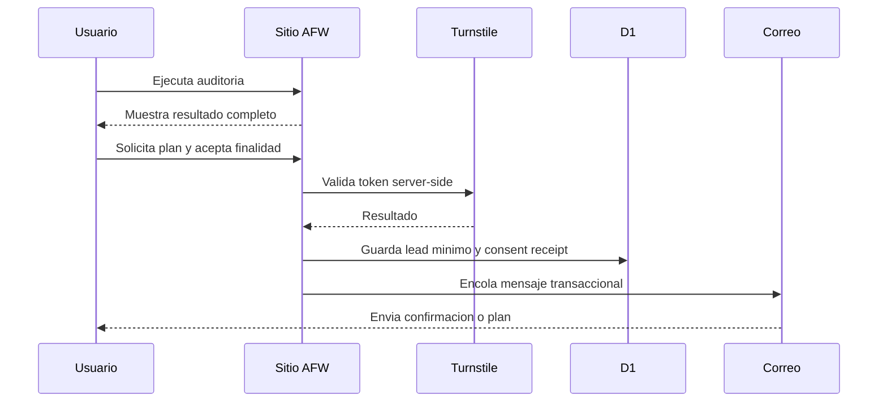

# Email, Lead Capture and Consent Architecture v1

**Estado:** arquitectura y codigo local de staging preparados; captura remota y correo no desplegados

**Fecha:** 2026-08-31

**Dominio propuesto:** `agentfriendlyweb.dev`

## Objetivo

Crear un canal de contacto util para humanos y operable por agentes sin convertir una auditoria publica en una trampa de captura de datos.

## Principio de producto

El visitante primero recibe valor. La auditoria completa permanece disponible sin registro. Despues puede pedir que Agent Friendly Web le envie un plan, lo contacte o lo incorpore voluntariamente a novedades.

## Consentimientos separados

| Finalidad | Control | Estado inicial | Prueba conservada |
| --- | --- | --- | --- |
| Enviar resultado o plan solicitado | accion expresa | requerido para esa solicitud | texto/version, fecha, dominio y canal |
| Contacto comercial sobre el proyecto | accion expresa | desmarcado | finalidad y version |
| Newsletter y actualizaciones | checkbox separado | desmarcado | idioma, fuente y version |
| Publicar caso o testimonio | aprobacion posterior | no disponible en intake | alcance exacto y version aprobada |

Aceptar un plan no suscribe a marketing. Dar un email no acredita control del sitio. Pagar no autoriza publicar.

## Direcciones propuestas

- `hello@agentfriendlyweb.dev`: identidad canonica y entrada humana universal;
- `hola@agentfriendlyweb.dev`: alias de entrada para espanol;
- `ola@agentfriendlyweb.dev`: alias de entrada para portugues;
- `auditoria@agentfriendlyweb.dev`: resultados y planes solicitados;
- `seguridad@agentfriendlyweb.dev`: vulnerabilidades o abuso;
- `bajas@agentfriendlyweb.dev`: baja y preferencias;
- `no-reply@agentfriendlyweb.dev`: solo mensajes transaccionales cuando exista proveedor de salida.

Todos los aliases se normalizan hacia una unica operacion y una unica historia de consentimiento. La primera implementacion puede usar Cloudflare Email Routing para reenviar entradas a una bandeja operativa. Email Routing no se trata como una bandeja completa ni como autorizacion para enviar. El proveedor de salida, SPF, DKIM, DMARC y reputacion se verifican en un gate separado.

## Flujo humano

## Datos minimos

### Lead

- `lead_id` aleatorio;
- email normalizado;
- nombre opcional;
- dominio auditado;
- rol y organizacion opcionales;
- idioma;
- objetivo seleccionado;
- estado del pipeline;
- origen y campaign metadata allowlisted;
- timestamps.

### Consent receipt

- `consent_id`;
- `lead_id`;
- finalidad canonica;
- version del texto;
- accion `granted`, `withdrawn` o `superseded`;
- timestamp;
- hash de evidencia tecnica minima.

No se guardan contrasenas, tokens, cookies, cuerpos completos de email ni capturas privadas en la tabla de leads.

## Retencion propuesta

- consulta transaccional sin avance: revisar y eliminar a los 180 dias;
- lead comercial activo: conservar mientras exista una relacion y revision periodica;
- newsletter: conservar hasta baja o inactividad definida;
- recibos de consentimiento: periodo separado segun politica legal y contable aprobada;
- bajas: conservar solo la supresion minima necesaria para no reinscribir.

Estos periodos son una politica de producto propuesta, no una declaracion de cumplimiento universal. Deben revisarse para las jurisdicciones y proveedores usados antes de desplegar.

## Proteccion contra abuso

- Turnstile con validacion obligatoria mediante Siteverify en servidor;
- rate limiting por señal tecnica saneada;
- normalizacion y validacion de dominio/email;
- links de baja con tokens de un solo uso y expiracion;
- CSP y escapes de salida;
- rechazo de secretos probables en texto libre;
- limites de longitud;
- colas y reintentos acotados;
- alertas por rebotes y quejas.

## Rol de Codex

### Puede preparar

- clasificacion por tema e idioma;
- resumen de la consulta;
- busqueda de evidencia publica;
- borrador de respuesta;
- proxima pregunta;
- propuesta basada en catalogo y campos aprobados;
- seguimiento de SLA y recordatorio.

### Puede enviar solo con politica aprobada

- confirmacion de recepcion;
- instrucciones publicas ya verificadas;
- resultado solicitado;
- seguimiento reversible y no contractual.

### Requiere revision humana

- precios fuera del catalogo;
- compromisos de plazo;
- contratos, reembolsos, impuestos o datos de pago;
- incidentes de seguridad;
- datos personales sensibles;
- disputas;
- publicacion de casos;
- cualquier accion sobre el sitio del cliente.

Codex no necesita ver contrasenas para operar el correo. Las capacidades se entregan por tool allowlisted y la auditoria registra metadata, no secretos ni cuerpos completos.

## Eventos de analitica

- `audit_completed`;
- `plan_cta_viewed`;
- `plan_requested`;
- `marketing_consent_granted`;
- `marketing_consent_withdrawn`;
- `lead_qualified`;
- `proposal_sent`;
- `proposal_accepted`;
- `delivery_verified`.

Cloudflare Web Analytics puede medir trafico agregado sin reemplazar los consent receipts ni el CRM. Los eventos de negocio deben conservar solo identificadores internos y campos necesarios.

## Gates

1. Contrato y copy ESP/ENG/POR.
2. Tests de normalizacion, consentimientos separados, Turnstile y rate limits.
3. Migracion D1 aditiva con backup/rollback.
4. UI en staging y pruebas de accesibilidad.
5. Politica de privacidad, retencion y baja revisada.
6. DNS y Email Routing con aprobacion separada.
7. Remitente de salida verificado y canary a una allowlist.
8. Codex en modo borrador; envio automatico solo para plantillas allowlisted.

## Estado tecnico al 2026-08-31

- el endpoint publico permanece fisicamente cerrado y no lee cuerpos;
- existe una ruta candidata separada para un futuro staging privado;
- el gate externo exige hostname exacto, identidad Sites, allowlist y kill switch antes de leer el cuerpo;
- rate limiting, Turnstile y D1 son bindings obligatorios y la ausencia de cualquiera falla cerrada;
- el cuerpo JSON se limita a 8 KiB mediante lectura incremental;
- la pagina candidata utiliza solamente `example.com` y queda fuera de sitemap, navegacion e indexacion;
- no se crearon recursos remotos, no se aplicaron migraciones y no se habilitaron datos reales.
- Gate 6C incorpora una politica local `planned_draft_only` que clasifica solo metadata minima y no acepta cuerpos completos ni adjuntos;
- la politica separa solicitudes transaccionales de consentimiento para novedades, exige revision humana en asuntos sensibles y no puede enviar;
- DNS, casillas, routing y proveedor siguen sujetos a aprobacion separada.

## Actualizacion Gate 6C.1 - 2026-09-02

La recepcion entrante quedo verificada: Cloudflare Email Routing, MX/SPF/DKIM y los aliases `hello@`, `hola@` y `ola@` estan configurados y recibieron exactamente un mensaje de prueba cada uno desde una identidad externa allowlisted; `no-reply@` no entrego y el catch-all permanece deshabilitado. El estado es `inbound_canary_verified`. No se habilitaron proveedor de salida, envio, respuestas automaticas, newsletter, lectura agentica, D1 ni CRM. Esas capacidades requieren gates y aprobacion separada.

El detalle de implementacion y rollback vive en `docs/BLOCK-6B-CONTACT-STAGING-ALLOWLIST-V1.md` y `docs/BLOCK-6C-EMAIL-ROUTING-DRAFT-LOCAL-GATE-2026-08-31.md`.

## Actualizacion Gate 6C.2A - 2026-09-02

Cloudflare Email Service fue seleccionado como proveedor previsto de salida, pero permanece sin configurar. El inventario read-only confirma cero dominios emisores incorporados; el preview oficial de `agentfriendlyweb.dev` identifica seis registros DNS faltantes y cero conflictos. El estado contractual es `provider_selected_remote_unconfigured`.

El preflight local y su contrato publico no realizan red ni envios. `hello@agentfriendlyweb.dev` sera remitente y `Reply-To`; el primer destino se identifica solo como `verified_destination_1`. Cloudflare Email Service, DNS, Workers Paid, binding `send_email`, destinatarios arbitrarios, respuestas automaticas, marketing y persistencia permanecen OFF. La incorporacion del dominio y el unico canary humano son dos decisiones remotas separadas.

El detalle vive en `docs/BLOCK-6C2-EMAIL-OUTBOUND-CANARY-LOCAL-GATE-2026-09-02.md`.

## Actualizacion Gate 6C.2B - 2026-09-02

`agentfriendlyweb.dev` fue incorporado a Cloudflare Email Service. Los seis registros de retorno y autenticacion quedaron publicados sin conflictos, y un canary humano unico llego al destino verificado con SPF, DKIM y DMARC en `pass`. El estado contractual es `human_canary_verified_binding_blocked`.

La prueba uso Cloudflare REST API como operacion puntual. No se creo binding, Worker, ruta, cron ni reintento; por eso `outbound_sending` sigue `false` como capacidad recurrente. Un envio futuro requiere primero un caso transaccional definido y Gate 6C.3. La evidencia saneada vive en `docs/BLOCK-6C2B-EMAIL-OUTBOUND-REMOTE-CANARY-2026-09-02.md`.

## Actualizacion Gate 6C.3A - 2026-09-02

El primer caso transaccional quedo seleccionado e implementado localmente: `internal_review_ready` avisa al destino interno ya verificado que una solicitud esta lista para revision humana. El estado es `transactional_case_selected_local_ready_remote_disabled`.

La ruta cerrada solo admite identificadores opacos, template y proposito fijos, idioma, idempotencia y aprobacion humana. El destinatario futuro queda fijado por el binding Cloudflare; no se acepta ni publica en el request. La entrega es `at-most-once`, reserva primero en D1 y conserva auditoria `metadata-only`. No hay reintentos automaticos.

El kill switch sigue en `false` y no existe migracion D1 remota, binding de email, binding de rate limit ni despliegue de esta ruta. Gate 6C.3B debe verificar Access, aislar D1, aplicar la migracion, crear bindings y superar pruebas negativas antes de solicitar un unico canary controlado. El detalle vive en `docs/BLOCK-6C3A-EMAIL-REVIEW-READY-LOCAL-GATE-2026-09-02.md`.

## Actualizacion Gate 6C.3B fase 1 - 2026-09-02

La frontera cerrada quedo desplegada en `afw_email_review_ready_canary` con estado `remote_database_and_closed_route_ready_binding_pending`. La D1 aislada recibio solamente la migracion aditiva `0006`, conserva cero filas de entregas y cuenta con backup saneado y rollback documentado. La ruta permanece detras de Cloudflare Access y el rate limiter nativo esta configurado.

El kill switch continua en `false` y no existe binding `send_email`, destino privado, envio automatico ni segundo correo. Esta fase prepara una infraestructura comprobable, no una capacidad operativa. La fase 2 debe incorporar el destino fijo y la allowlist hash fuera de Git, volver a probar el cierre y mantener el flag OFF antes de considerar un unico canary humano. La evidencia vive en `docs/BLOCK-6C3B-EMAIL-REVIEW-READY-REMOTE-CLOSED-2026-09-02.md`.

## Actualizacion Gate 6C.3B fase 2 - 2026-09-02

El destino fijo y la allowlist de identidad opaca quedaron configurados exclusivamente en Cloudflare, fuera de Git, bajo estado `private_bindings_ready_kill_switch_off`. El destino no se acepta por request ni se publica, el secreto no es recuperable por API y el kill switch continua en `false`.

## Actualizacion Gate 6C.3B fase 3 - 2026-09-02

La identidad humana Access y la validacion JWT de aplicacion quedaron comprobadas. Una superficie privada sin campos libres ejecuto el contrato fijo con el kill switch apagado y obtuvo `404 email_review_ready_unavailable`, `sent=false`; la consulta agregada posterior confirmo cero entregas y cero escrituras en D1. El estado avanza a `authenticated_negative_probe_verified_kill_switch_off`. Un unico canary real requiere confirmacion humana en el momento de la accion y deshabilitacion inmediata posterior.

Access rechazo solicitudes sin identidad, produccion mantuvo la ruta ausente y D1 conservo cero filas. No se envio correo en esta fase. La evidencia vive en `docs/BLOCK-6C3B-EMAIL-REVIEW-READY-PRIVATE-BINDINGS-2026-09-02.md` y `docs/BLOCK-6C3B-EMAIL-REVIEW-READY-AUTHENTICATED-NEGATIVE-PROBE-2026-09-02.md`.

## Actualizacion Gate 6C.3B fase 4 - 2026-09-03

Luego de una confirmacion humana exacta se habilito temporalmente el canary y se ejecuto un solo intento `internal_review_ready`. Hubo una invocacion al proveedor, el evento quedo `failed`, no se recibio comprobante ni correo, no hubo reintento y se restauro inmediatamente la version con flag OFF. El estado vigente es `single_canary_attempt_failed_no_retry_kill_switch_off`.

La revision encontro `missing_explicit_to_field_for_fixed_destination_binding`: el mensaje omitia la propiedad que Cloudflare usa para sustituir el destino privado fijo. La correccion `to: undefined` paso de dos fallos esperados a `13/13` pruebas especificas, pero continua solo local y sin verificacion remota. Otro intento requiere suite completa, despliegue con flag OFF, prueba negativa autenticada y nueva confirmacion humana en el momento de la accion. La evidencia vive en `docs/BLOCK-6C3B-EMAIL-REVIEW-READY-SINGLE-CANARY-ATTEMPT-2026-09-03.md`.

## Actualizacion Gate 6C.3B fase 5 - 2026-09-03

La correccion fue desplegada finalmente en la version canary `7b25f69e-d30e-4ee4-be0e-c2deafed0f3d`, deployment `7f81a402-38c0-4a72-b883-1088dfd734a6`, preservando el binding privado sin revelar su destino y con `AFW_EMAIL_REVIEW_READY_ENABLED=false`. La prueba negativa autenticada mostro envio bloqueado y devolvio `HTTP 404`, `sent=false`, `email_review_ready_unavailable`.

D1 permanecio en una fila historica (`failed=1`, `sent=0`, `reserved=0`) y no hubo invocaciones nuevas al proveedor ni correos. El estado avanza a `corrected_off_version_verified_negative_probe_passed`. Esto verifica el despliegue cerrado, no la entrega corregida: `remotely_verified_fix` continua en `false` hasta un eventual canary exitoso. Antes de otro intento resta una nueva confirmacion humana exacta en el momento de la accion. La evidencia vive en `docs/BLOCK-6C3B-EMAIL-REVIEW-READY-CORRECTED-OFF-NEGATIVE-PROBE-2026-09-03.md`.

## Actualizacion Gate 6C.3B fase 6 - 2026-09-03

La version corregida se habilito temporalmente para un unico intento humano aprobado. El proveedor fue invocado una vez y rechazo nuevamente el mensaje; no hubo entrega, recibo ni reintento. El rollback `ce8635ee-03d5-4f21-96c4-46efb886aaf5` restauro inmediatamente la version OFF `7b25f69e-d30e-4ee4-be0e-c2deafed0f3d`. D1 conserva dos filas historicas `failed`, cero `sent` y cero `reserved`; el uso diario del proveedor y Gmail confirman cero correos. El estado vigente es `corrected_single_canary_attempt_failed_no_retry_kill_switch_off`.

La hipotesis `to: undefined` queda descartada como solucion remota suficiente. La siguiente candidata local es `explicit_to_null_with_sanitized_provider_failure_codes`: conserva el destino exclusivamente en el binding y clasifica solo codigos tecnicos permitidos, sin persistir errores crudos. Permanece sin desplegar y sin otro envio. La evidencia vive en `docs/BLOCK-6C3B-EMAIL-REVIEW-READY-SECOND-CANARY-ATTEMPT-2026-09-03.md`.

## Pruebas negativas obligatorias

- auditoria accesible sin email;
- checkbox marketing no premarcado;
- un consentimiento no habilita otro;
- token Turnstile ausente, invalido o reutilizado;
- email invalido o disposable segun politica;
- texto con secreto probable;
- repeticion idempotente;
- baja invalida, vencida o repetida;
- intento de leer lead de otro actor;
- reintento de correo que no duplica el mensaje.

## Fuentes primarias

- Cloudflare Email Service: `https://developers.cloudflare.com/email-service/`
- Cloudflare Email Routing: `https://developers.cloudflare.com/email-service/get-started/route-emails/`
- Cloudflare Turnstile: `https://developers.cloudflare.com/turnstile/get-started/`
- Cloudflare D1: `https://developers.cloudflare.com/d1/`
- Cloudflare Web Analytics: `https://developers.cloudflare.com/web-analytics/about/`
