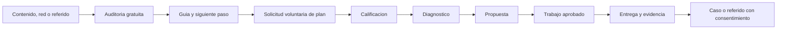

# Growth and Monetization Roadmap

**Fecha:** 2026-08-31

**Estado:** roadmap aprobado; activaciones remotas pendientes de gates propios

**Producto:** Agent Friendly Web

**Responsable:** Gabriel Mucchiut

## Objetivo

Transformar Agent Friendly Web de una plataforma tecnicamente demostrable en un negocio que consiga conversaciones, convierta problemas reales en entregas verificables y aprenda que segmentos valoran mas el servicio.

El objetivo no es cobrar por publicar archivos aislados. El valor esta en diagnosticar, conciliar informacion, priorizar, preparar una implementacion segura, coordinar al owner y al mantenedor y demostrar el cambio con evidencia reproducible.

## Tesis comercial

Las busquedas humanas se estan desplazando parcialmente hacia respuestas sintetizadas y asistentes. Una organizacion puede tener un sitio visible para navegadores y seguir siendo ambigua para un agente: datos importantes dispersos, servicios sin contratos, contenido contradictorio, politicas de crawlers indiferenciadas y ausencia de fuentes citables.

Agent Friendly Web ofrece un recorrido progresivo. No promete que un modelo cite o recomiende al cliente. Si promete una entrega controlable: hacer que la informacion correcta sea mas descubrible, legible, verificable y utilizable, y mostrar que cambio.

## Orden de prelacion

Este documento gobierna **Gate 6: producto y operacion**. La identidad empresarial, el modelo operativo, la preparacion previa al lanzamiento y las alternativas de capital pertenecen a **Gate 7: construccion empresarial y capital**, documentado por separado en `docs/COMPANY-BUILDING-AND-CAPITAL-ROADMAP-2026-09-02.md`. Ningun gate financiero activa capacidades tecnicas.

### Gate de infraestructura - origen Cloudflare-native

**Estado:** candidato verificado y canary propio desplegado detras de Access; D1 aislada y vacia; 0% del trafico del origen publico; paridad autenticada y QA responsive cerrados; rollback preparado; corte pendiente de decision separada.

Antes de reabrir captacion, correo o CRM remoto, Agent Friendly Web debe abandonar Sites como runtime operativo. El unico canary permitido sera `canary.agentfriendlyweb.dev`, protegido por Cloudflare Access, con UI/API same-origin, D1 propia, paridad publica y rollback probado. Las referencias Tokenizart permanecen como caso documental y no como dependencias de ejecucion.

### Gate 6A - Traccion F1

**Estado:** cerrado y fusionado el 2026-08-31. La estrategia se revisa con evidencia de 90 dias.

- casos de credibilidad en arte, cultura, coleccionismo e instituciones con patrimonio;
- canal multiplicador con agencias y mantenedores web;
- primer producto repetible para grupos de hospitalidad, hoteles boutique, bodegas, espacios de eventos y restaurantes con reservas directas;
- auditoria gratuita sin email obligatorio;
- Discovery Pack F0/F1 a F3 como primera oferta paga;
- embudo, KPIs y limites;
- arquitectura de contacto, correo y pagos;
- diagramas y plan de explicacion interactiva.

### Gate 6B - Captura consentida

**Estado:** preview publico cerrado, UI privada Sites retirada y frontera Worker 6B.1/6B.2 conservada solo como evidencia remota OFF, con Access, Turnstile, escrituras deshabilitadas y D1 vacia. Persistencia de contactos reales y correo permanecen deshabilitados.

**Dependencias para datos reales:** corte Cloudflare-native cerrado, una nueva definicion same-origin del flujo, prueba sintetica idempotente aprobada, politica de privacidad revisada, backup/rollback validado y una aprobacion posterior especifica para contactos reales.

1. Mostrar el resultado completo de la auditoria.
2. Ofrecer `Recibir mi plan` como accion opcional.
3. Pedir email, nombre, rol, dominio, idioma y objetivo minimo.
4. Registrar consentimiento transaccional con version y fecha.
5. Ofrecer newsletter en un control separado y desmarcado.
6. Validar Turnstile en servidor.
7. Permitir baja, rectificacion y eliminacion segun politica aprobada.

La version publica permite completar y revisar localmente la solicitud, pero no la envia ni la almacena. El contrato publico declara `preview_only`. Gate 6B.1/6B.2 demostro una frontera Worker con JWT Access firmado, host y CORS exactos, allowlist, kill switch, rate limiting nativo, Turnstile y D1 aislada, siempre con escrituras OFF y cero filas. Esa frontera no se trata como staging vigente. El diseño futuro sera same-origin dentro de `afw_canary` y no se contara como captacion activa hasta cerrar migracion, prueba sintetica y autorizacion de datos reales.

### Gate 6C - Correo operativo

**Direccion canonica candidata:** `hello@agentfriendlyweb.dev`.

**Estado actual:** el estado previo `planned_draft_only` avanzo a `inbound_canary_verified`. Gate 6C.1 tiene destino privado verificado, DNS de Email Routing y reglas entrantes activas para `hello@`, `hola@` y `ola@`; una prueba externa confirmo una entrega por alias, cero entregas para `no-reply@` y catch-all deshabilitado. Gate 6C.2B incorporo el dominio remitente, verifico SPF/DKIM/DMARC y recibio un unico canary humano. Gate 6C.3A selecciono e implemento localmente un aviso interno listo para revision. Gate 6C.3B desplego la ruta cerrada, D1 migrada, rate limiter, destino fijo e identidad opaca fuera de Git. El estado intermedio fue `private_bindings_ready_kill_switch_off`; luego supero la prueba negativa autenticada y avanzo a `authenticated_negative_probe_verified_kill_switch_off`. El primer intento real confirmado no produjo entrega: hubo una invocacion, cero reintentos y rollback inmediato a OFF. El estado vigente es `single_canary_attempt_failed_no_retry_kill_switch_off`; `missing_explicit_to_field_for_fixed_destination_binding` esta corregido localmente pero no verificado de forma remota. Envios, billing, marketing y automatizaciones permanecen OFF.

El cierre comprobado de Gate 6C.2B se conserva como antecedente `human_canary_verified_binding_blocked`; Gate 6C.3A agrega preparacion local, no reemplaza ni repite aquel envio.

Aliases locales: `hola@agentfriendlyweb.dev` y `ola@agentfriendlyweb.dev`. Todos llegan a la misma operacion; no se crean silos por idioma.

- recepcion y routing desde Cloudflare;
- remitente y DKIM/SPF/DMARC segun proveedor de salida;
- bandejas o etiquetas para `auditoria`, `ventas`, `soporte`, `seguridad` y `bajas`;
- respuestas allowlisted asistidas por Codex;
- revision humana para compromisos, pagos, incidentes y asuntos sensibles;
- logs sin cuerpos completos ni secretos;
- politica de tiempos de respuesta.

El cierre local se documenta en `docs/BLOCK-6C-EMAIL-ROUTING-DRAFT-LOCAL-GATE-2026-08-31.md`. El gate solo se considerara operativo despues de verificar routing de entrada, autenticacion del remitente, proveedor de salida, canary allowlisted y rollback.

La secuencia remota se divide para reducir riesgo:

- **Gate 6C.1:** identidad `hello@`, aliases, Cloudflare Email Routing entrante, prueba allowlisted, kill switch y rollback; sin salida autonoma ni newsletter. Diseno: `docs/BLOCK-6C1-EMAIL-IDENTITY-AND-INBOUND-CANARY-DESIGN-2026-09-02.md`.
- **Gate 6C.2A:** Cloudflare Email Service seleccionado, costos fechados, baseline saneado, contrato y preflight local verificados; cero subdominios emisores y seis registros DNS pendientes, sin mutaciones.
- **Gate 6C.2B:** cerrado el 2026-09-02 con dominio, seis DNS y un unico canary a `verified_destination_1`; SPF, DKIM y DMARC pasaron. No se dejo binding ni automatizacion activa.
- **Gate 6C.3A:** caso `internal_review_ready` seleccionado y preparado localmente con template fijo ESP/ENG/POR, destino fijo por binding, semantica `at-most-once`, idempotencia, rate limit, kill switch y auditoria `metadata-only`. No fue desplegado.
- **Gate 6C.3B fase 1:** cerrado sobre `afw_email_review_ready_canary`: Access exacto, D1 aislada, migracion `0006`, rate limiter y deploy con flag OFF. No existe binding `send_email` y no se envio correo.
- **Gate 6C.3B fase 2:** destino fijo y allowlist hash provisionados fuera de Git; Access sin identidad responde `302`, produccion `404`, D1 conserva cero filas y el flag sigue OFF.
- **Gate 6C.3B fase 3:** Access y la aplicacion validaron al operador; la prueba negativa devolvio `404`, `sent=false`, `email_review_ready_unavailable`, sin invocar proveedor ni escribir D1. Falta una confirmacion humana en el momento de la accion antes de un unico canary fijo.
- **Gate 6C.3B fase 4:** la confirmacion fue obtenida y se ejecuto un solo intento. El proveedor fue invocado una vez, el evento quedo `failed`, no se entrego correo, no hubo reintento y el kill switch volvio a OFF. La omision contractual de `to: undefined` fue reproducida y corregida localmente; otro intento exige validacion completa, despliegue OFF, prueba negativa y nueva confirmacion en el momento de la accion.

### Gate 6D - Ventas y CRM ligero

**Estado local:** maquina de estados y planificador `local_planning_only` implementados sin PII, datos reales, D1, email, propuestas ni pagos. Toda persistencia remota requiere aprobacion separada y debe comenzar despues del canary `afw_canary` de Gates 6B y 6C.

Estados minimos:

`new -> qualified -> discovery -> proposal -> approved -> delivery -> verified -> won/lost`

Cada oportunidad registra dominio, segmento, problema, owner, mantenedor, alcance, evidencia, siguiente accion, fecha, valor estimado y motivo de perdida. No se duplican cuerpos de email ni credenciales.

La evidencia local vive en `docs/BLOCK-6D-CRM-LITE-LOCAL-GATE-2026-08-31.md`. El pipeline no salta etapas, los estados terminales no se reabren y propuesta, aprobacion, entrega, verificacion y cierre mantienen revision humana.

### Gate 6E - Primer piloto pago humano

- catalogo privado de alcance y precio;
- propuesta simple con entregables y exclusiones;
- metodo de pago aprobado;
- comprobante, conciliacion y politica de cancelacion;
- una entrega completa con horas y costo medidos;
- retrospectiva para ajustar precio.

### Gate 6F - Comercio agentico

- un recurso pago concreto;
- contrato OpenAPI/MCP versionado;
- precio y moneda machine-readable;
- sandbox sin fondos reales;
- x402 o MPP con idempotencia y recibo;
- pruebas de pago invalido, repetido, vencido y reembolsado;
- canary limitado antes de anunciarlo.

### Gate 6G - A2A y operacion privada

- Agent Card solo para un agente real;
- OAuth y protected resource metadata desde el servicio real;
- tareas, estados, cancelacion y observabilidad;
- MCP privado con scopes owner;
- capsula firmada y adaptadores allowlisted;
- pagos separados de autorizacion.

### Linea futura - creacion de sitios AFW-native

Despues de validar la transformacion de sitios existentes, Agent Friendly Web evaluara la **creacion de sitios AFW-native** desde cero. No es una capacidad disponible ni operativa hoy. La propuesta combinara un front humano claro con contenido machine-readable, descubrimiento, evidencia y herramientas reales desde su arquitectura inicial.

Los primeros arquetipos previstos son sitios personales verificables, profesionales, institucionales, catalogos y servicios locales. Cada uno partira de la identidad y la informacion declarada por el owner, conservara dominio y activos exportables, documentara como migrar a otro proveedor y operara sin lock-in. Esta linea podra monetizar diseno, implementacion, integraciones y mantenimiento opcional sin convertir la suscripcion en condicion para conservar el sitio o sus entregables.

La creacion se planificara como Gate 7H dentro de `docs/COMPANY-BUILDING-AND-CAPITAL-ROADMAP-2026-09-02.md`; no altera la prelacion inmediata de Gates 6B, 6C y 6D.

## Oferta y precio como hipotesis

Estos valores sirven para aprender costos y disposicion a pagar. No constituyen una tarifa publica aprobada.

| Oferta | Hipotesis de alcance | Hipotesis de precio |
| --- | --- | --- |
| Auditoria publica | lectura tecnica basica, sin persistencia | gratuita |
| Diagnostico guiado | plan priorizado y devolucion breve | USD 29-79 |
| Discovery Pack piloto | un dominio, un idioma, cinco areas, capsula y evidencia | USD 99 para los primeros pilotos; revisar despues de medir horas |
| Implementacion F0/F1 a F3 | publicacion coordinada, validaciones y cierre | USD 250-600 segun CMS y acceso |
| F3 a F5 | API, MCP, skills, auth, A2A o flujos custom | PDR y cotizacion desde USD 1.500 |
| Monitoreo | reauditoria y mantenimiento editorial real | opcional, segun frecuencia y consumo |

Una implementacion manual completa no debe venderse por USD 10 o 20. Ese precio solo puede corresponder a un diagnostico automatizado con limites estrictos. Las ofertas temporales deben tener una razon, alcance y fecha verdaderos.

El Discovery Pack prepara diagnostico, contenido, archivos y plan de publicacion; no incluye aplicar cambios en el origen. La implementacion comienza solamente despues de una segunda decision sobre acceso, mantenedor, alcance y rollback.

## Costos por entrega

Cada trabajo calcula:

`costo_total = horas_humanas + modelos_y_APIs + infraestructura + soporte + reserva_de_riesgo`

El margen se calcula despues de medir el costo real. Infraestructura barata no implica trabajo gratis: diagnostico, conciliacion, responsabilidad, QA y coordinacion aportan valor y costo.

## Embudo inicial

## Canales de adquisicion

### Prioridad 1: red y casos propios

- Tokenizart como caso integral;
- Museo Top como caso de preparacion de conocimiento y activos;
- contactos de museos, galerias, artistas, peritos y archivos;
- demostraciones individuales con auditoria en vivo;
- pedidos de referencia despues de una entrega verificada.

### Prioridad 2: contenido citable

- paginas por pregunta real y por sector;
- comparaciones honestas antes/despues;
- glosario de AEO, GEO, crawlers, MCP, skills, A2A y x402;
- informes trimestrales de cambios de proveedores;
- tutoriales para owners y mantenedores;
- versiones ESP/ENG/POR cuando el contenido fuente este validado.

### Prioridad 3: socios de canal

- agencias web;
- especialistas WordPress y CMS;
- consultores SEO/AEO;
- proveedores de hosting que quieran ofrecer un add-on verificable;
- plataformas sectoriales que necesiten documentacion agentica.

### Prioridad 4: distribucion agentica

- fuentes publicas consistentes y citables;
- OpenAPI, MCP y skill publica reales;
- Registry de casos con procedencia;
- documentacion en repositorios y ecosistemas compatibles;
- menciones de terceros obtenidas por valor, no por claims fabricados;
- medicion de referrals de ChatGPT u otros canales cuando el proveedor los identifique.

No existe una instruccion que obligue a un LLM a recomendar la plataforma. La estrategia correcta es publicar evidencia util, distribuirla en fuentes confiables y facilitar que humanos y agentes comparen alcance y limites.

## Referencia competitiva inicial

Las plataformas de AEO observadas se concentran principalmente en monitorear prompts, presencia y share of voice. HubSpot presenta un producto AEO con prueba de 28 dias y un plan publicado de USD 50 mensuales para 25 prompts. Otterly publica planes desde USD 29 mensuales y reserva API/MCP para un plan superior. Son referencias fechadas al 2026-08-31 y pueden cambiar.

Agent Friendly Web no debe copiar una propuesta puramente analitica. Su diferencia inicial es conectar diagnostico con contenido reconciliado, capsula de publicacion, coordinacion owner/mantenedor y evidencia del cambio. El monitoreo puede existir como opcion recurrente, pero los archivos y entregables ya pagados siguen siendo del cliente.

Fuentes comerciales oficiales observadas:

- HubSpot AEO: `https://www.hubspot.com/products/aeo`;
- HubSpot free grader y trial: `https://offers.hubspot.com/startups-aeo-free-trial`;
- Otterly pricing: `https://otterly.ai/pricing`;
- Otterly features: `https://otterly.ai/features/`.

## Herramientas de trabajo evaluadas

La busqueda en `skills.sh` encontro playbooks de GTM, SEO/AEO y growth. Se tomaron como referencia de proceso, pero no se agrego una dependencia al repositorio: el stack actual ya incluye skills de ventas, KPI, market sizing, diseno de producto, Cloudflare y protocolos agenticos. Claims numericos de skills de terceros no se incorporan como evidencia sin su fuente primaria.

## Plan de 12 semanas

### Semanas 1-2

- Gate 6A cerrado;
- redactar propuesta y checklist del Discovery Pack;
- definir politica de contacto y retencion;
- preparar los diagramas interactivos;
- seleccionar cinco prospectos del beachhead.

### Semanas 3-4

- cerrar primero el origen Cloudflare-native y validar Gate 6B dentro de `afw_canary` con aprobacion separada;
- configurar analitica de privacidad y eventos del embudo;
- probar tres versiones del mensaje y una sola CTA primaria;
- realizar cinco auditorias asistidas sin cobro.

### Semanas 5-6

- cerrar Gate 6C con correo operativo;
- entrevistar a cinco responsables y dos mantenedores;
- convertir dos diagnosticos en propuesta;
- medir tiempo y puntos de friccion.

### Semanas 7-9

- ejecutar uno o dos pilotos pagos humanos;
- completar evidencia antes/despues;
- ajustar alcance y precio;
- preparar un caso publicable con aprobacion.

### Semanas 10-12

- abrir canal de agencias;
- publicar el primer informe sectorial;
- evaluar sandbox x402/MPP para una reauditoria machine-readable;
- decidir si avanzar a A2A, monitoreo o un segundo vertical.

## KPIs y umbrales

| Dimension | Metrica | Umbral de aprendizaje inicial |
| --- | --- | --- |
| Interes | auditorias completas por semana | 10 |
| Comprension | usuarios que abren guia o siguiente paso | 30% |
| Intento | solicitudes voluntarias de plan | 10% de auditorias completas |
| Calidad | leads que encajan en beachhead | 50% de solicitudes |
| Venta | propuestas aceptadas | 20% de propuestas |
| Entrega | trabajos a tiempo y sin rollback no planificado | 90% |
| Economia | horas reales dentro de estimacion | +/- 25% |
| Confianza | casos con consentimiento de publicacion | 1 cada 3 entregas |
| Privacidad | contactos sin consentimiento valido | 0 |

Estos umbrales son hipotesis de arranque, no benchmarks de mercado. Se revisan con datos reales.

## Decisiones que no deben adelantarse

- comprar listas de emails;
- bloquear la auditoria detras de un lead form;
- enviar newsletter sin consentimiento separado;
- anunciar precios no sostenibles como oferta permanente;
- afirmar que un score causa ventas o citas;
- publicar OAuth, Agent Card o x402 sin servicio real;
- compartir credenciales generales con un modelo;
- hacer del monitoreo una suscripcion obligatoria para conservar entregables ya pagados.

## Documentos relacionados

- `docs/COMPANY-BUILDING-AND-CAPITAL-ROADMAP-2026-09-02.md`
- `docs/FOUNDER-NARRATIVE-AND-BRAND-FOUNDATION-V1.md`
- `docs/SERVICE-DELIVERY-AND-VALUE-CHAIN-MAP-V1.md`
- `docs/BLOCK-6C1-EMAIL-IDENTITY-AND-INBOUND-CANARY-DESIGN-2026-09-02.md`

- `docs/INITIAL-GO-TO-MARKET-AND-SALES-MOTION-V1.md`
- `docs/EMAIL-LEAD-CAPTURE-AND-CONSENT-ARCHITECTURE-V1.md`
- `docs/AGENTIC-COMMERCE-X402-MPP-ARCHITECTURE-V1.md`
- `docs/INTERACTIVE-DIAGRAMS-AND-EXPLAINERS-ROADMAP-V1.md`
- `docs/MARKET-AND-LOCALE-EXPANSION-STRATEGY-V1.md`
- `docs/EXTERNAL-AUDIT-AND-EVIDENCE-REGISTRY-2026-08-30.md`
- `docs/A2A-DEPLOYMENT-CAPSULE-ROADMAP.es.md`
