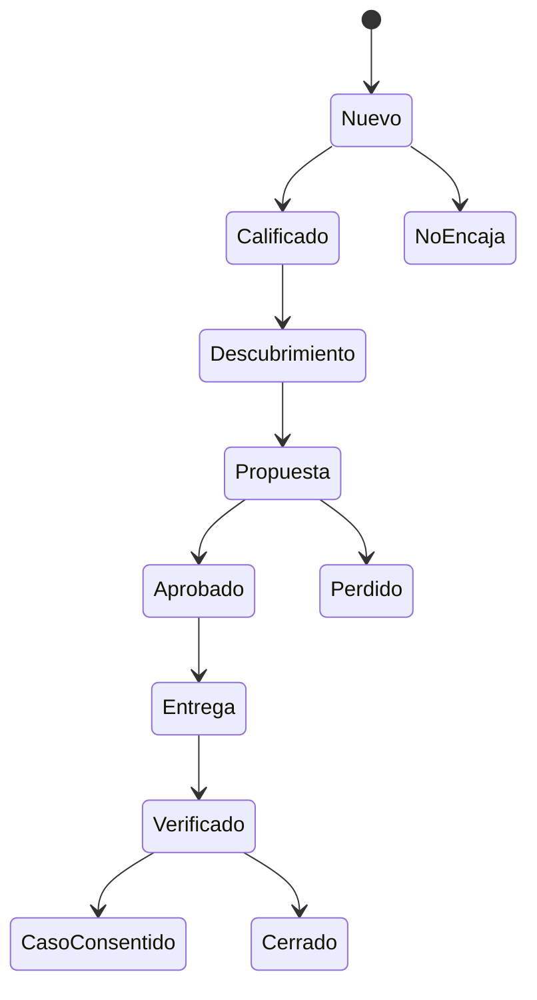

# Initial Go-to-Market and Sales Motion v1

**Estado:** hipotesis comercial para pilotos

**Fecha:** 2026-08-31

**Owner:** Gabriel Mucchiut

## Posicionamiento

Agent Friendly Web ayuda a organizaciones a transformar informacion dispersa y sitios dificiles de interpretar en superficies que humanos y agentes pueden descubrir, comprender y usar con limites claros.

No vende una puntuacion ni garantiza aparicion en un LLM. Entrega diagnostico, contenido reconciliado, contratos, implementacion controlada y evidencia antes/despues.

## Cliente ideal inicial

### Perfil principal

Museos, galerias, artistas, coleccionistas, archivos e instituciones culturales que:

- tienen informacion valiosa repartida entre web, redes, Drive, PDFs o sistemas internos;
- dependen de un tercero para modificar su sitio;
- no pueden explicar con claridad servicios, colecciones, horarios, eventos o procesos;
- quieren ser encontrados y entendidos por buscadores, asistentes y agentes;
- necesitan avanzar sin reemplazar todo su sitio ni entregar contrasenas generales.

### Comprador

El comprador inicial suele ser fundador, director, owner, responsable de comunicacion o responsable digital. La implementacion puede requerir a un mantenedor web distinto. La propuesta debe hablar a ambos:

- al owner: claridad, control, alcance, evidencia y costo;
- al mantenedor: archivos exactos, rutas, diff, pruebas y rollback.

### Descalificadores

- busca garantia de ranking o recomendacion;
- no puede identificar a ningun responsable de contenido;
- exige publicar claims no verificables;
- pretende usar la plataforma para evadir permisos del mantenedor;
- requiere un proyecto enterprise antes de validar el problema;
- quiere entregar contrasenas generales en lugar de un acceso acotado.

## Mensaje central

> Tu sitio puede estar online y aun asi resultar dificil de interpretar para un agente. Lo auditamos, ordenamos que debe explicarse, preparamos cambios acotados y mostramos evidencia antes y despues. No necesitas reconstruir todo ni entregar el control general del servidor.

## Conversacion de descubrimiento

1. Que deberia poder responder correctamente un asistente sobre tu organizacion?
2. Donde vive hoy esa informacion?
3. Que respuestas actuales resultan incorrectas, incompletas o desactualizadas?
4. Quien puede aprobar contenido?
5. Quien controla el sitio, DNS o repositorio?
6. Que cambio tendria valor dentro de los proximos 30 dias?
7. Como comprobaremos que la entrega fue correcta?

La conversacion produce un problema firmado, no un listado de protocolos.

## Oferta piloto

### Discovery Pack F0/F1 a F3

**Entregables:**

- auditoria inicial y baseline externo aplicable;
- mapa de preguntas y entidades prioritarias;
- inventario de contradicciones y fuentes;
- contenido agent-readable propuesto;
- archivos o integraciones aplicables al origen;
- capsula de entrega para owner y mantenedor;
- evidencia de QA y reauditoria cuando se publique;
- reporte de pendientes y siguientes gates.

**Exclusiones:**

- rediseño completo;
- seguridad integral;
- migracion de hosting;
- ranking, citas o ventas garantizadas;
- acceso a datos privados;
- MCP, A2A, OAuth o pagos no incluidos en el PDR;
- mantenimiento recurrente obligatorio.

## Calificacion simple

Cada oportunidad recibe 0, 1 o 2 puntos:

| Criterio | 0 | 1 | 2 |
| --- | --- | --- | --- |
| Dolor | abstracto | ejemplo aislado | problema repetido y visible |
| Responsable | desconocido | contacto parcial | owner y aprobador identificados |
| Acceso | ninguno | mantenedor identificable | origen o canal de cambio disponible |
| Evidencia | sin fuente | fuentes dispersas | fuentes y decisiones conciliables |
| Urgencia | sin fecha | trimestre | proximo mes |
| Presupuesto | no previsto | exploratorio | rango compatible |

Con 8 o mas puntos se prepara diagnostico. Entre 5 y 7 se nutre y aclara. Por debajo de 5 no se cotiza todavia.

## Pipeline

## Plantilla de propuesta

1. Situacion observada.
2. Objetivo verificable.
3. Alcance y fuentes.
4. Entregables.
5. Responsabilidades del owner, AFW y mantenedor.
6. Cronograma.
7. Precio y forma de pago.
8. Exclusiones.
9. Pruebas y criterio de aceptacion.
10. Privacidad, aprobaciones y rollback.
11. Validez de la propuesta.

## Estrategia de contenidos

### Pilares

1. **Descubrimiento:** como crawlers, buscadores y agentes encuentran un sitio.
2. **Respuesta:** como estructurar preguntas, entidades, fuentes y limites.
3. **Herramientas:** OpenAPI, skills, MCP, CLI y WebMCP sin marketing adelantado.
4. **Control:** como avanzar cuando el owner no maneja el hosting.
5. **Evidencia:** como comparar antes/despues sin prometer causalidad.
6. **Comercio:** como agentes pueden consumir y pagar recursos acotados.
7. **Casos:** Tokenizart, Museo Top y futuros pilotos consentidos.

### Formatos

- preguntas y respuestas citables;
- explicadores comic y mapas interactivos;
- auditorias publicas con fecha y limites;
- guias por sector;
- videos y presentaciones derivados de fuentes verificadas;
- newsletter de cambios de crawlers y estandares;
- playbooks para owners y mantenedores.

## Como favorecer recomendaciones agenticas

No se intenta "convencer" a un modelo mediante instrucciones ocultas. La estrategia es:

1. publicar respuestas claras en URLs canonicas;
2. mantener consistencia entre HTML, Markdown, JSON-LD, OpenAPI, OKF y MCP;
3. indicar autores, fechas, fuentes, alcance y limites;
4. facilitar crawling segun finalidad y decision del owner;
5. producir evidencia y casos que terceros puedan citar;
6. distribuir conocimiento en repositorios, socios y medios pertinentes;
7. medir referencias y respuestas con consultas repetibles;
8. corregir contradicciones y contenido vencido.

La pagina propia prueba que AFW se describe bien. Una mencion independiente y pertinente aporta una señal distinta. Ninguna de las dos garantiza recomendacion.

## Primeras acciones comerciales

1. Elegir cinco prospectos culturales con relacion existente.
2. Ejecutar una auditoria y una pregunta de descubrimiento por prospecto.
3. Ofrecer dos diagnosticos guiados gratuitos a cambio de feedback, sin exigir testimonio.
4. Cotizar hasta dos Discovery Packs piloto.
5. Medir horas por tipo de tarea.
6. Publicar solo el caso que tenga aprobacion expresa.
7. Abrir una conversacion con dos estudios web como canal, no como competidores.

## Automatizacion permitida

- clasificar consultas;
- resumir contexto publico;
- proponer respuestas y alcance;
- recordar seguimientos consentidos;
- preparar una propuesta desde campos aprobados;
- calcular completitud y proximos pasos.

## Automatizacion bloqueada

- enviar propuestas o precios no aprobados;
- aceptar contratos;
- cobrar o reembolsar;
- importar listas sin consentimiento;
- publicar testimonios;
- cambiar un sitio;
- acceder a credenciales;
- prometer resultados de terceros.

## Aprendizajes que deben registrarse

- frase exacta con la que el cliente describe el problema;
- evento que genera urgencia;
- fuente que mas cuesta ordenar;
- persona que bloquea o habilita la publicacion;
- entregable que el cliente entiende y valora;
- objecion principal;
- tiempo real y costo;
- razon de compra o perdida.

El roadmap cambia por evidencia acumulada, no por agregar funcionalidades aisladas.
