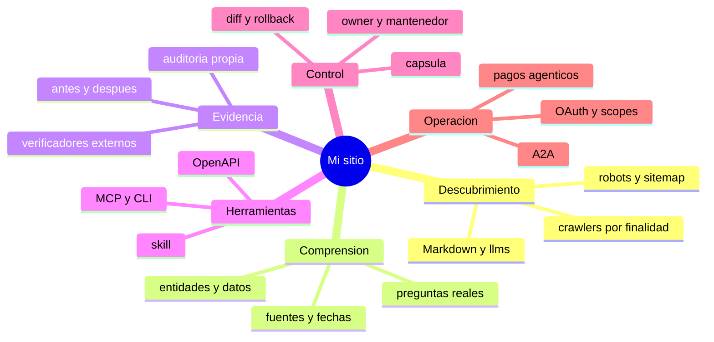
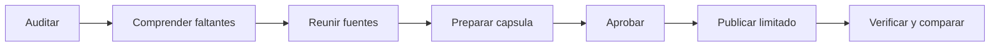
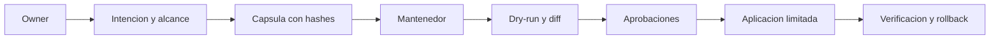
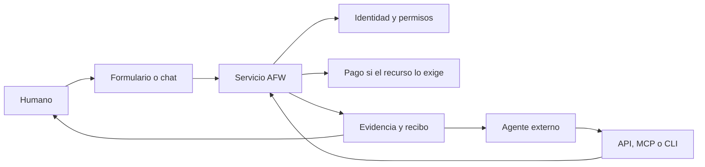
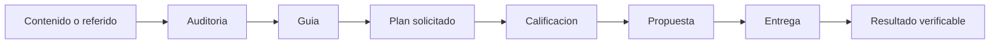

# Interactive Diagrams and Explainers Roadmap v1

**Estado:** diseno de producto

**Fecha:** 2026-08-31

**Idiomas objetivo:** ESP, ENG y POR

## Objetivo

Ayudar a una persona no tecnica a comprender el sistema sin leer toda la documentacion lineal. La experiencia debe conservar el estilo comic, mostrar progresion y permitir abrir una rama por vez.

## Ruta propuesta

`/como-funciona`

La ruta funcionara como un mapa interactivo y explicador. No reemplaza la metodologia ni el sitemap. Presenta el contenido canonico en una estructura visual.

## Mapa raiz



## Recorrido humano

1. El robot F0 aparece con manos vacias.
2. La persona elige un problema: `No me encuentran`, `Me explican mal`, `No controlo el sitio` o `Quiero que agentes usen mis servicios`.
3. El mapa abre solo la rama relevante.
4. Cada nodo muestra una explicacion simple, evidencia esperada y accion siguiente.
5. Los detalles tecnicos permanecen colapsados.
6. La persona puede ejecutar una auditoria o pedir un plan al final, no antes.

## Componentes

### ComicJourneyMap

- nodos como carpetas o expedientes;
- hilo visual que conecta cada capa;
- robot F0-F5 como marcador de progreso;
- un nodo activo por nivel;
- zoom y paneo solo donde resulte necesario;
- lista accesible equivalente.

### EvidenceDrawer

- `Que significa`;
- `Como se verifica`;
- `Que no demuestra`;
- `Ver fuente`;
- `Agregar a mi plan`.

### BeforeAfterScene

- pregunta humana;
- respuesta previa observada o ilustrativa;
- cambio realizado;
- respuesta posterior;
- evidencia y limites.

### GateTimeline

- discovery;
- contenido;
- herramientas;
- permisos;
- operacion;
- comercio.

Cada gate muestra `no iniciado`, `propuesto`, `aprobado`, `desplegado`, `verificado`, `stale` o `no aplica`. No usa solamente color.

## Modelo de contenido

La UI se genera desde datos versionados, por ejemplo:

```json
{
  "id": "discovery.llms",
  "stage": "F1",
  "title": "Indice para agentes",
  "summary": "Orienta hacia las fuentes publicas mas utiles.",
  "evidence": ["/.well-known/agent-readiness.json", "/llms.txt"],
  "limits": ["llms.txt es una propuesta comunitaria"],
  "next": ["content.questions", "evidence.baseline"]
}
```

Los textos no se duplican manualmente en tres componentes. Se derivan de un catalogo validado y enlazan a fuentes existentes.

## Diagramas prioritarios

### 1. De auditoria a entrega



### 2. Owner sin acceso tecnico



### 3. Humano, agente y pago



### 4. Embudo comercial



## Reglas de experiencia

- tipografia de cuerpo legible; comic solo en titulos y acentos;
- texto sin superponerse con ilustraciones;
- ningun nodo depende de hover;
- controles con foco, teclado y etiquetas;
- orden de lectura util sin JavaScript;
- layout estable en 390, 768, 1024 y 1440 px;
- no anidar cards decorativas;
- no usar animaciones que impidan leer;
- `prefers-reduced-motion` respetado;
- diagramas complejos ofrecen vista lista;
- una CTA principal por estado.

## Chatbot y mapa

La guia conversacional podra abrir un nodo exacto mediante IDs allowlisted. El mapa podra enviar una pregunta estructurada a la guia. Ninguna de las dos superficies inventa estado owner ni ejecuta acciones.

Ejemplo:

- usuario: `No entiendo por que necesito llms.txt`;
- guia: explica limite y fuente;
- accion visual: abre `discovery.llms`;
- siguiente accion: auditar si existe y si su contenido es valido.

## Implementacion por gates

1. **D1 - Catalogo local:** schema, fixtures y validacion de enlaces.
2. **D2 - Prototipo:** mapa y lista accesible con datos sinteticos.
3. **D3 - Integracion:** fuentes reales AFW y deep links desde guia, FAQ y home.
4. **D4 - Idiomas:** paridad ESP/ENG/POR y fallos cerrados ante traduccion faltante.
5. **D5 - Evidencia:** snapshots, audit results y comparador.
6. **D6 - Personalizacion owner:** solo con identidad y expediente autorizado.

## Criterios de aceptacion

- una persona puede explicar AF0-F5 despues de un recorrido corto;
- el mismo mapa sirve en escritorio y movil;
- cada claim enlaza una fuente o indica que es propuesta;
- ningun nodo declara una capacidad futura como desplegada;
- la lista accesible conserva todo el contenido;
- el chatbot y el mapa comparten IDs canonicos;
- la ruta funciona sin capturar email;
- Lighthouse/accessibility y QA visual no muestran solapamientos.
