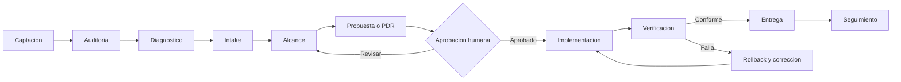
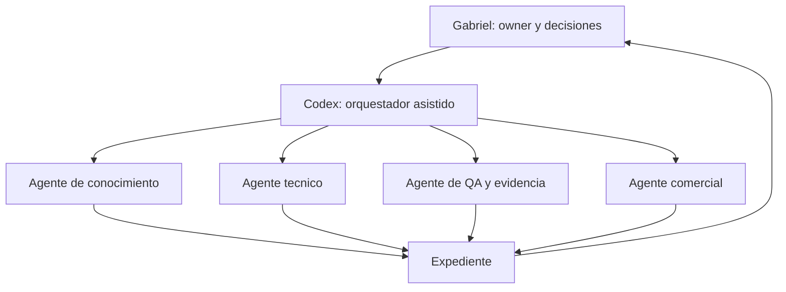

# Service Delivery and Value Chain Map v1

**Estado:** modelo operativo de referencia

**Audiencia:** owners, mantenedores, equipo operativo, partners e inversores autorizados

## Vista general

La cadena no comienza con una venta ni termina al publicar un archivo. El valor consiste en comprender el sitio, reconciliar su verdad, aplicar un cambio delimitado y demostrar el resultado.

## Etapas

| Etapa | Entrada | Resultado | Gate humano |
| --- | --- | --- | --- |
| Captacion | contenido, referido o busqueda | visita con contexto | consentimiento solo si deja contacto |
| Auditoria | dominio publico | evidencia y faltantes observados | no requiere email para el resultado basico |
| Diagnostico | auditoria y objetivo | prioridades y riesgos | owner confirma el problema real |
| Intake | datos ordenados o notas libres | contexto conciliado | owner revisa lo interpretado |
| Alcance | prioridades, control tecnico y restricciones | entregables, exclusiones y dependencias | owner y mantenedor validan responsabilidades |
| Propuesta/PDR | alcance y estimacion | precio, tiempo, gates y evidencia esperada | aceptacion expresa |
| Aprobacion | propuesta revisada | autorizacion delimitada | nunca se infiere por silencio |
| Implementacion | capsula, permisos minimos y rollback | cambios en destino autorizado | doble aprobacion cuando owner y mantenedor son distintos |
| Verificacion | version implementada | pruebas, auditoria y comparacion | aceptar, corregir o revertir |
| Entrega | evidencia conforme | archivos, recibos y documentacion propiedad del cliente | confirmacion de cierre |
| Seguimiento | vigencia, cambios y nuevas necesidades | reauditoria o trabajo opcional | sin suscripcion obligatoria |

## Vista publica

La version publica explica que ocurre, que recibe el cliente, que decisiones conserva y como se verifica. No muestra costos internos, datos personales, proveedores privados, secretos, margenes ni instrucciones de acceso.

## Vista privada

La version privada agrega:

- horas humanas por funcion;
- consumo de modelos y APIs por tarea;
- infraestructura y herramientas;
- soporte, contingencia y reserva de riesgo;
- costo de adquisicion y canal;
- precio, margen y desviacion respecto de la estimacion;
- responsables y dependencias;
- incidentes, rollback y retrabajo.

La formula de observacion es:

`costo_total = horas humanas + modelos y APIs + infraestructura + soporte + reserva de riesgo`

No se utiliza como tarifa publica automatica. Alimenta la cotizacion, el aprendizaje y los escenarios low/base/high.

## Orquestacion

Los subagentes preparan resultados acotados. Codex concilia el expediente y Gabriel conserva aprobacion sobre publicacion, precio, contrato, capital, pagos y cambios sensibles.

## Entregables minimos

1. baseline fechado;
2. fuentes y declaraciones separadas;
3. roadmap priorizado;
4. alcance y exclusiones;
5. capsula o paquete versionado;
6. diff o vista previa;
7. aprobacion registrada;
8. pruebas y evidencia posterior;
9. rollback disponible o motivo documentado;
10. inventario final propiedad del cliente.

## Excepciones

- Sin control del origen: preparar expediente externo y paquete para mantenedor.
- Sin fuentes suficientes: detener claims y registrar `Missing`.
- Con datos contradictorios: volver a intake y solicitar decision.
- Con credenciales en texto: rechazar la entrada y usar un canal de secretos aprobado.
- Con prueba fallida: no cerrar entrega; corregir o ejecutar rollback.
- Con cambio fuera de alcance: emitir nueva propuesta, no ampliar silenciosamente.

## Indicadores iniciales

- tiempo desde auditoria hasta diagnostico;
- porcentaje de intake completado;
- propuestas aceptadas;
- desviacion de horas;
- cambios verificados sin rollback no planificado;
- casos publicables con consentimiento;
- reincidencia de contradicciones;
- costo por entrega y margen observado.

