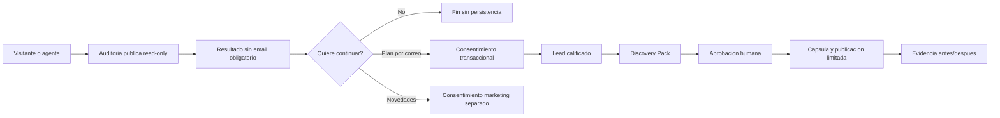
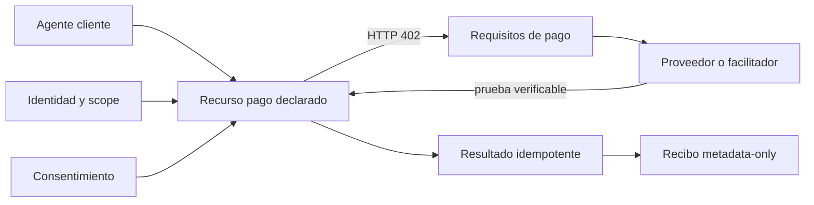

# Agent Friendly Web Growth and Monetization Gate v1

**Fecha:** 2026-08-31

**Estado:** diseno aprobado para documentacion y preparacion tecnica

**Responsable de producto:** Gabriel Mucchiut

**Alcance:** traccion, contacto, ventas, medicion y comercio agentico sin activacion remota

## Decision

El siguiente gate se denomina **Gate 6A - Traccion F1**. Su objetivo no es agregar otro protocolo a la portada. Su objetivo es convertir la capacidad tecnica ya construida en una oferta entendible, medible y vendible sin adelantar capacidades ni pedir credenciales generales.

El gate ordena seis frentes:

1. elegir un segmento inicial accesible;
2. definir una oferta concreta y su evidencia de entrega;
3. disenar captura de contacto y consentimiento sin bloquear la auditoria gratuita;
4. especificar el correo operativo y el rol asistido de Codex;
5. separar pagos humanos de pagos agenticos;
6. definir metricas, diagramas y criterios de avance.

La aprobacion vigente permite diseno, documentacion, contratos, pruebas locales y preparacion de planes. No activa DNS de correo, envio automatico, almacenamiento de leads, cobros, x402, OAuth, A2A ni nuevas escrituras remotas.

## Problema que resuelve

Agent Friendly Web ya demuestra discovery, contenido machine-readable, CLI, MCP read-only, WebMCP experimental, Registry, OKF y una capsula de publicacion progresiva. Esa base todavia no constituye por si sola un sistema comercial. Faltan una entrada de bajo riesgo, una promesa delimitada, una forma consentida de continuar la conversacion y una medicion que conecte actividad con aprendizaje comercial.

El mayor riesgo actual no es tecnico. Es intentar vender "agentizacion" como una categoria abstracta y demasiado amplia. El comprador humano necesita reconocer:

- que informacion importante de su organizacion hoy resulta dificil de encontrar o interpretar;
- que cambios concretos se proponen;
- quien debe aprobarlos;
- que evidencia se obtendra antes y despues;
- cuanto cuesta el alcance y que queda fuera;
- como puede continuar sin una suscripcion obligatoria.

## Segmento inicial

### Beachhead

El primer segmento de credibilidad sera **arte, cultura, coleccionismo e instituciones con patrimonio**, incluyendo artistas, galerias, museos, archivos y sus proveedores web. La eleccion responde a ventajas reales:

- Gabriel y Tokenizart ya poseen lenguaje, casos, contactos y conocimiento del dominio;
- la informacion suele estar fragmentada entre sitios, redes, catalogos, PDFs y sistemas internos;
- fechas, autores, obras, horarios, politicas y servicios se benefician de respuestas citables;
- Tokenizart y Museo Top permiten construir evidencia sin inventar un caso ajeno;
- el trabajo puede comenzar por discovery y contenido sin exigir una reconstruccion completa del sitio.

### Canal multiplicador

El canal prioritario sera **agencias, estudios web y mantenedores WordPress**. No se los presenta como adversarios. Se los convierte en socios de implementacion mediante paquetes exactos, diffs, dry-runs y recibos. Un estudio puede aplicar el metodo a multiples clientes y reducir la friccion de acceso al origen.

El primer producto sectorial repetible se probara en **hospitalidad**: grupos de restaurantes, hoteles boutique, bodegas y espacios de eventos. Estos sitios concentran preguntas con impacto comercial y datos cambiantes. El restaurante independiente de bajo ticket se abordara mediante un paquete simple o un partner, no con consultoria intensiva.

### Segmentos posteriores

- municipios y organismos con informacion publica compleja;
- restaurantes, hoteleria, turismo y comercios con horarios, sedes y servicios variables;
- servicios profesionales con FAQs, requisitos y procesos repetitivos;
- plataformas digitales con APIs, herramientas o documentacion que agentes puedan consumir.

La expansion se habilita cuando el primer segmento produce cinco conversaciones calificadas, dos entregas completas y al menos un caso publicable con consentimiento.

## Oferta inicial

### Entrada gratuita

**Auditoria publica read-only.** No exige email para ver el resultado. Muestra evidencia, limites y una siguiente accion. El email aparece despues como opcion para recibir un plan o continuar con asistencia.

### Primer producto pago

**Discovery Pack F0/F1 a F3.** Alcance piloto:

- un dominio;
- un idioma principal;
- hasta cinco paginas o areas prioritarias;
- auditoria propia y externa fechada;
- inventario de contradicciones y vacios;
- propuesta de `llms.txt`, contenido estructurado y recursos aplicables;
- capsula o instrucciones exactas para el mantenedor;
- evidencia antes/despues cuando la publicacion sea autorizada;
- reunion o devolucion escrita de cierre.

No incluye rediseño completo, migracion de CMS, garantia de citas, OAuth, MCP privado, A2A, pagos, mantenimiento permanente ni acciones sin aprobacion.

### Escalera de valor

1. Auditoria publica gratuita.
2. Diagnostico guiado y plan priorizado.
3. Discovery Pack F0/F1 a F3.
4. Implementacion asistida mediante capsula y mantenedor.
5. Integraciones F3 a F5: OpenAPI, MCP, skills, autenticacion y flujos agenticos con PDR propio.
6. Monitoreo editorial o tecnico opcional cuando exista una tarea recurrente demostrable.

Los precios iniciales son hipotesis internas y no se publican hasta validar tiempo, soporte y disposicion a pagar. No se usara una rebaja ficticia ni una cuenta regresiva artificial.

## Principios de contacto

- La auditoria gratuita no se convierte en un formulario obligatorio.
- "Enviame mi plan" y "Quiero recibir novedades" son consentimientos distintos.
- La suscripcion de marketing queda desmarcada por defecto.
- Cada mensaje comercial incluye origen del contacto y baja simple.
- El chat puede ordenar una consulta, pero no inscribe ni envia sin confirmacion.
- El email no acredita control de un dominio ni concede permiso de publicacion.

## Correo operativo

El canal canonico candidato es `hello@agentfriendlyweb.dev`, con `hola@` y `ola@` como aliases locales y aliases funcionales para auditoria y seguridad. Cloudflare Email Routing puede recibir y reenviar mensajes cuando el dominio usa DNS de Cloudflare. La salida conserva proveedor, identidad y auditoria separados.

Codex podra clasificar, resumir, preparar respuestas y responder asuntos allowlisted cuando exista una conexion autorizada. No sera un custodio informal de contrasenas ni un emisor irrestricto. Consultas contractuales, pagos, reembolsos, incidentes, datos personales sensibles y compromisos comerciales fuera de catalogo conservan revision humana.

## Pagos

### Humanos

El primer cobro debe usar un checkout o instruccion de pago comprensible, factura o recibo y conciliacion. La cuenta, proveedor, impuestos, moneda y politica de reembolso requieren decision Nivel 1 separada.

### Agentes

x402 o MPP se evaluaran para recursos delimitados, por ejemplo una reauditoria machine-readable o un External Evidence Pack. El pago no reemplaza identidad, autorizacion, consentimiento ni scope. Un recurso pago debe definir precio, moneda, resultado, expiracion, idempotencia, recibo, tratamiento de fallos y soporte.

## Arquitectura de confianza

## Metricas del gate

### Norte inicial

**Entregas verificadas que llegan a una decision humana.** Una auditoria solo cuenta como aprendizaje comercial cuando el visitante comprende un siguiente paso y decide continuar, posponer o rechazar.

### Embudo

- auditorias validas iniciadas y completadas;
- porcentaje que abre el detalle o la guia;
- solicitudes voluntarias de plan;
- consentimientos de marketing separados;
- conversaciones calificadas;
- propuestas enviadas;
- propuestas aceptadas;
- entregas terminadas;
- tiempo humano por entrega;
- margen bruto estimado;
- casos con permiso de publicacion;
- cancelaciones, bajas y reclamos.

### Calidad y confianza

- porcentaje de claims con fuente y fecha;
- fallos de deteccion o falsos positivos reportados;
- porcentaje de cambios aceptados por el owner y el mantenedor;
- reversiones necesarias;
- diferencia entre resultado propio y verificadores externos;
- consultas resueltas sin pedir secretos.

## Gates de implementacion

1. **6A - Traccion F1:** este diseno, oferta, segmentos, metricas y roadmap.
2. **6B - Contacto consentido:** UI, Turnstile, D1 minima, politica de privacidad, baja y pruebas negativas.
3. **6C - Correo operativo:** DNS y routing aprobados, remitente verificado, bandeja, playbook y auditoria.
4. **6D - CRM ligero y ventas:** estados de lead, pipeline, plantillas, tiempos y reportes.
5. **6E - Primer piloto pago humano:** catalogo, checkout, recibo, conciliacion y soporte.
6. **6F - Comercio agentico sandbox:** recurso concreto, x402/MPP, idempotencia y pruebas sin dinero real.
7. **6G - A2A y tools privadas:** agente remoto, Agent Card, OAuth, scopes, cancelacion y auditoria.

Cada gate conserva aprobacion separada si modifica DNS, almacena contactos, envia correo, cobra, toca produccion o habilita una tool mutante.

## Criterios de aceptacion

- existe un beachhead y un canal secundario, no una lista indiferenciada;
- la oferta define entradas, salidas, limites y evidencia;
- la auditoria gratuita permanece disponible sin email;
- contacto transaccional y marketing se separan;
- correo humano y automatizacion agentica tienen fronteras;
- pagos humanos y x402/MPP se modelan como rails distintos;
- las metricas miden aprendizaje y entrega, no solo trafico;
- ningun endpoint, mailbox, checkout o agente se declara activo sin prueba publica;
- el roadmap contiene dependencias, gates y aprobaciones.

## Fuentes primarias

- Cloudflare Agent Readiness: `https://blog.cloudflare.com/agent-readiness/`
- Cloudflare Email Service: `https://developers.cloudflare.com/email-service/`
- Cloudflare Email Routing: `https://developers.cloudflare.com/email-service/get-started/route-emails/`
- Cloudflare Turnstile: `https://developers.cloudflare.com/turnstile/get-started/`
- Cloudflare D1: `https://developers.cloudflare.com/d1/`
- Cloudflare x402: `https://developers.cloudflare.com/agents/tools/payments/x402/`
- Cloudflare agent payments: `https://developers.cloudflare.com/agents/tools/payments/`
- A2A Protocol: `https://a2a-protocol.org/latest/specification/`
